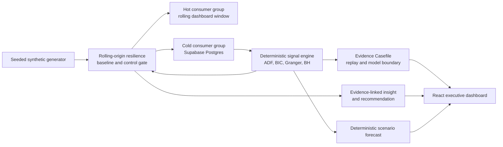

# MetricThread

**Grounded cross-functional intelligence for auditable business decisions.**

MetricThread is an Enterprise Intelligence Agent for a VP-of-Growth workflow. It continuously simulates Client, Financial, and Partner signals; identifies statistically corrected predictive lead-lag evidence; exposes every retained signal as an auditable Evidence Casefile; requires resilience validation before a new model narrative can become a recommendation; and lets an executive test one constrained marketing-spend scenario.

Every metric, insight, and forecast in the current product is labelled **synthetic live simulation**. The project demonstrates a method for auditable decision support; it does not make claims about a real business, prove causality, or take external actions autonomously.

## The executive journey

1. Start the synthetic live simulation: one compressed business day (nine events) emits every five seconds.
2. Inspect the accepted evidence: partner referral quality is predictive of client acquisition cost in the seeded fixture after correction for the complete candidate family.
3. Open the Evidence Casefile: replay the source and target series, inspect every candidate/rejected result, stationarity preparation, q/F/effect/sample/fingerprint values, the compact provider packet, cited IDs, immutable confidence, and causal-language refusal.
4. Inspect Evidence Resilience: rolling-origin windows compare the signal-assisted forecast with a target-history-only baseline, require every negative control to stay rejected, and suppress unstable signals from new model narratives.
5. Review an evidence-linked narrative, recommendation, confidence decomposition, and human-controlled decision status.
6. Ask a grounded follow-up. Factual answers cite stored insight and signal IDs; unsupported questions explicitly return `no_evidence`.
7. Test a deterministic marketing-spend change over one through seven days. The returned baseline, forecast interval, reliability, assumptions, and signal IDs are stored or, in judge-demo mode, calculated without a durable write.

## Architecture



The stream uses independent hot and cold consumer groups, acknowledgements, recovery, and idempotent cold writes. The signal engine requires 60 usable daily observations, applies stationarity preparation and BIC-selected history through seven days, then retains only Benjamini–Hochberg adjusted `q <= 0.05` evidence. A score named `confidence_v1` is deterministic (significance 40%, incremental effect 25%, sample adequacy 20%, recency 15%); a model may narrate it but cannot change it. `resilience_rolling_origin_v1` evaluates four historical origins, requires the accepted signal in at least three, requires at least three target-history baseline wins, and requires both declared controls to remain rejected at every origin before a new recommendation is eligible.

## Evidence semantics

- A displayed relationship is **predictive lead-lag evidence**, never proof that one business event caused another.
- Evidence includes source/target metrics, p and q values, F statistic, effect size, sample size, BIC model history, a stable fingerprint, and confidence components.
- The generator deliberately plants a partner-referral-quality to CAC relationship and two unrelated negative controls. These are test fixtures, not real-world findings.
- Grounded narratives receive a compact accepted-evidence packet, must cite stored IDs, are checked server-side, and reject causal wording or unknown citations.
- A Casefile recomputes the deterministic test family in memory for inspection but never overwrites persisted evidence.
- Resilience assessments are versioned and linked to an exact evidence fingerprint. A missing, stale, or failing assessment blocks a new model-generated recommendation; it does not erase past human decision records.
- Recommendation actions stay human-controlled: `proposed → planned → implemented`; only an implemented recommendation can receive a measured outcome.

## Local setup

Requirements: Python 3.13+, [uv](https://docs.astral.sh/uv/), Node 20+ and npm. Create your own `.env`; it is ignored by Git.

```bash
cp .env.example .env
uv sync
cd frontend && npm ci && cd ..
./scripts/test
```

Configure the variables in `.env`:

- `UPSTASH_REDIS_REST_URL` and `UPSTASH_REDIS_REST_TOKEN` are required for the simulator and Stream consumers.
- `SUPABASE_URL` and `SUPABASE_SECRET_KEY` are required for the server-side durable data, evidence, and decision stores. Never place the secret key in `frontend/`.
- `AI_PROVIDER=gemini`, `GEMINI_API_KEY`, and `GEMINI_MODEL=gemini-3.1-flash-lite` provide the documented development fallback. `AI_PROVIDER=openai`, `OPENAI_API_KEY`, and a funded `OPENAI_REASONING_MODEL` are required before claiming live GPT-5.6 output.

The first two migrations and the canonical 1,620-row fixture are already applied to the project used during development. For a fresh Supabase project, apply the existing foundation and signal-engine migrations and seed according to the SQL/Python commands in the charter. Phase 6 additionally requires `db/migrations/003_phase6_readiness.sql` and `db/migrations/004_evidence_resilience.sql` before running the current API against Supabase. If a direct Postgres connection is available, use:

```bash
uv run python -m metricthread.cli migrate
uv run python -m metricthread.cli seed
uv run python -m metricthread.cli signals
uv run python -m metricthread.cli resilience
```

If direct database TCP is unavailable, open **Supabase Dashboard → SQL Editor → New query**, paste and run `db/migrations/003_phase6_readiness.sql` followed by `db/migrations/004_evidence_resilience.sql`. The latter creates versioned resilience records. Then run `uv run python -m metricthread.cli resilience` to persist the current active-signal assessments through the server-side Supabase Data API.

Start the backend and frontend in separate terminals:

```bash
uv run uvicorn metricthread.api:app --reload
cd frontend && npm run dev
```

Open `http://localhost:5173`. The Vite development proxy forwards API requests to `http://localhost:8000`.

## Validation

Run the full local check before proposing or committing changes:

```bash
./scripts/test
```

This runs the Python suite and a Vite production build. The raw Postgres integration test is intentionally skipped in the current environment because the Supabase pooler resets direct TCP connections; deployed persistence is tested through the server-side Supabase Data API instead. The exact historical test results and decisions are recorded in [the charter](enterprise_intelligence_agent_project_charter.md).

## Deployment and judge-demo mode

The supplied configuration builds the FastAPI API as a Render Docker service and the Vite frontend on Vercel. Follow the detailed [deployment runbook](docs/deployment-runbook.md). In short:

1. Apply the Phase 6 and Evidence Resilience Supabase migrations, then persist assessments with `uv run python -m metricthread.cli resilience`.
2. Deploy the API from `render.yaml` with `DEMO_READ_ONLY=true`.
3. Deploy the frontend with `VITE_API_BASE_URL` set to the Render API origin.
4. Set `CORS_ALLOWED_ORIGINS` on Render to the exact Vercel origin, redeploy, then run the rehearsal command.

Judge-demo mode prevents persistent signal analysis, AI generation, recommendation lifecycle changes, outcomes, and briefing generation. It still serves persisted evidence and insights, supports grounded chat, runs the labelled simulator, and calculates deterministic scenarios without durable writes. Its live cold-path status is explicitly labelled as an **in-memory read-only demo sink**; it is not presented as a durable Supabase write. The separate Phase 2 rehearsal verifies durable Stream-to-Supabase persistence.

```bash
uv run python -m scripts.phase6_rehearsal --base-url https://YOUR-RENDER-API.onrender.com
```

## Build Week record

The project was built in approval-gated phases with Codex used for repository implementation, tests, deployment configuration, and documentation. The reasoning integration was designed for GPT-5.6 and retains the OpenAI path, but the verified live development run used Gemini 3.1 Flash-Lite after the OpenAI account returned `insufficient_quota`. This is not presented as GPT-5.6 output.

Before submission, a funded OpenAI structured-output call must pass the same groundedness checks, and the public video must accurately show and narrate that result. The remaining evidence and manual checklist are in:

- [Codex and model collaboration record](docs/collaboration-record.md)
- [under-three-minute demo script](docs/demo-script.md)
- [submission checklist](docs/submission-checklist.md)

Build Week's public requirements include a working Codex + GPT-5.6 project, setup/sample-data documentation, a public sub-three-minute narrated YouTube demo, a repository with a license, and the relevant `/feedback` session ID. See the [official Devpost challenge page](https://openai.devpost.com/) for the current requirements.

## API surface

| Endpoint | Purpose |
| --- | --- |
| `GET /agent/status`, `GET /metrics/live` | Live-agent status and hot rolling metrics |
| `POST /simulation/start` | Start the labelled synthetic simulator |
| `GET /signals`, `POST /signals/run` | Accepted evidence and deterministic analysis |
| `GET /signals/{id}/casefile` | Read-only forensic replay, test-family ledger, model packet, citations, and causal-language guard |
| `GET /signals/{id}/resilience`, `POST /signals/{id}/resilience/run` | Versioned rolling-origin resilience record; persistent runs remain disabled in judge-demo mode |
| `GET /insights`, `GET /insights/{id}`, `POST /insights/generate` | Grounded narratives and recommendations |
| `POST /recommendations/{id}/status`, `POST /recommendations/{id}/outcomes` | Human-controlled decision tracking |
| `GET /briefings/latest`, `POST /briefings/generate`, `POST /chat` | Executive briefing and structured-retrieval chat |
| `POST /scenarios/forecast` | Bounded marketing-spend scenario |
| `GET /health` | Deployment health check |

## Production boundary

MetricThread is a Build Week prototype. It deliberately does not claim multi-tenant RBAC, real-data PII governance, calibrated production forecasts, durable scheduled jobs, or autonomous execution. The [production roadmap](enterprise_intelligence_agent_project_charter.md#11-production-improvement-roadmap) records the upgrade paths for those capabilities.

## License

This repository is available under the [MIT License](LICENSE).
