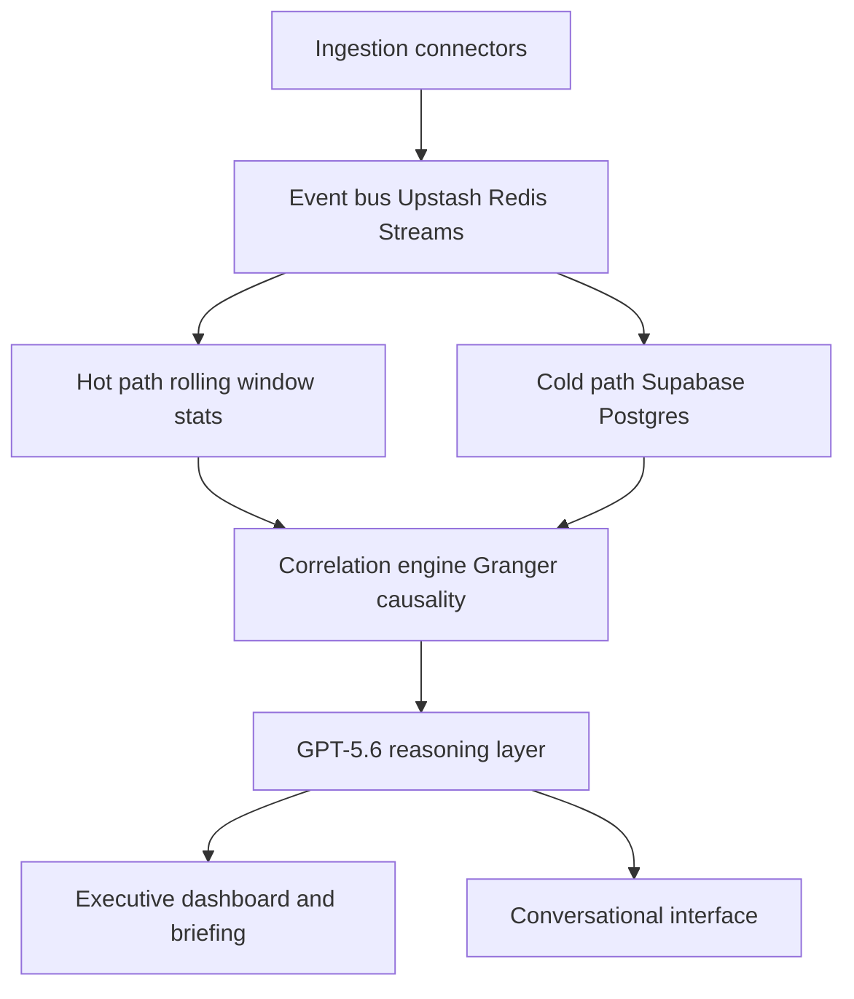
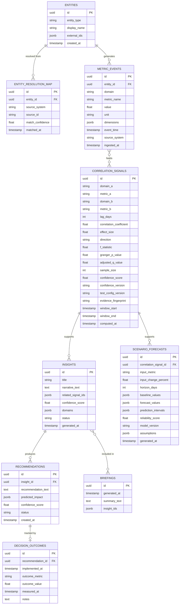

# MetricThread: Real-Time Enterprise Intelligence Agent
## Project Charter and Phase-Wise Build Plan

### Purpose of this document

This document is the single source of truth for the project across its full lifecycle. It exists for three reasons. First, it gives Codex a complete brief so the agent can research, refine, and build without guessing at intent. Second, it defines a phase structure where every sub-phase ends in testing and a documentation update, so the project never drifts ahead of its own record. Third, it is written to double as an interview preparation resource. Every architectural choice below is stated with its rationale and the alternatives that were considered, so any part of the system can be explained and defended later, not just described.

This document should be treated as living. Sections marked as living are expected to grow as phases complete.

---

## 1. Problem Statement

Enterprise data is fragmented across domain-specific systems: client data in a CRM, financial data in an ERP, partner performance in its own tracker, operational health in monitoring tools, competitive intelligence gathered informally, and compliance data held separately again. When an executive needs to answer a cross-domain question, such as why client acquisition cost is rising, the answer could originate in marketing, competitive pricing, partner referral quality, or product performance, and finding out requires manually pulling data from several systems and reconciling it by hand. By the time a report is compiled, the underlying data is already a week old, and the report answers what happened rather than what is happening now.

The core issue is that enterprises are data-rich but insight-poor. The data required to answer cross-domain questions already exists. What is missing is a layer that connects it, reasons over it in real time, and turns it into a specific, actionable recommendation rather than another dashboard.

## 2. Task and Category Fit

The build target is OpenAI Build Week, submitted under the Work and Productivity track, which covers tools that make teams and back-office operations faster and more effective through analytics and workflow automation. This problem statement fits that track directly: it is an analytics and decision-support tool for internal enterprise teams, not a consumer app, a developer tool, or an education product.

OpenAI Build Week judges submissions equally across Technological Implementation, Design, Potential Impact, and Quality of the Idea. The project must therefore prove all four: a real deterministic pipeline and grounded GPT-5.6 integration, a coherent executive workflow, a specific VP-of-Growth problem, and a distinctive auditable decision loop. Engineering time is still concentrated on the correlation and reasoning core, but the live product experience and reproducible submission evidence are first-class deliverables rather than polish deferred to the end.

Submission requirements to track through Phase 6: a working project built with Codex and GPT-5.6, the Work & Productivity category, a public or appropriately shared code repository, a README with setup instructions and sample data, a public YouTube demo under three minutes with audio explaining how Codex and GPT-5.6 were used, and the Codex `/feedback` session id from the session where the core functionality was built. The verified submission deadline is Tuesday, July 21, 2026 at 5:00 PM Pacific.

## 3. Expected Solution

The finished product should behave like a standing analytics function that never sleeps. It should notice a cross-domain predictive lead-lag relationship a human analyst would otherwise find only after days of manual correlation: in the initial synthetic scenario, declining partner referral quality predicts rising client acquisition cost three days later, with marketing spend shown as financial context. It should make the evidence, its computed confidence, and a specific recommended action visible rather than presenting a chart alone.

The differentiator against a generic BI dashboard with a chat layer bolted on is twofold. First, correlation is computed deterministically by a statistics layer before any language model reasons about it, so the system never asserts a relationship it has not actually found in the data. Second, every recommendation is tracked to an outcome, closing a feedback loop that most analytics tools never build, which is explicitly called out as a differentiator in the brief itself.

## 4. Guiding Design Principles

These principles are referenced throughout the rest of this document and should be checked against any new decision made during the build.

1. Correlation is deterministic, reasoning is interpretive. A statistics layer finds predictive lead-lag relationships in the data first. The language model explains their business relevance and recommends a controlled next step; it never asserts that the test proves causation.
2. Confidence is computed, not generated. Every insight and recommendation carries a numeric confidence score derived from correlation strength, data recency, and sample size, never a language model's self-reported certainty.
3. The schema is domain-agnostic. Data is stored in a generic, domain-tagged event model rather than one hardcoded table per business function, so adding a new domain is a schema addition, not a rewrite.
4. Every architectural choice favors free-tier infrastructure that maps cleanly onto its production equivalent, so nothing built during the hackathon needs to be thrown away later, only scaled up.
5. Every insight and every generated event is timestamped and stored, so system state is always replayable and auditable.

## 5. Scope for the Initial Build

Three domains are in scope for the first working version: Client, Financial, and Partner. They support a focused VP-of-Growth narrative without claiming an unmeasured competitor signal: partner referral quality predicts client acquisition cost at a three-day lag, and marketing spend provides financial context plus a constrained forecast input. Operational, Compliance, and Competitive intelligence extend naturally from the same schema and are scoped for later phases, described in Section 11.

Because no hackathon team has access to real, live CRM and ERP feeds, the initial build uses a deterministic synthetic dataset with known predictive relationships deliberately planted into it. It contains 180 daily observations across nine metrics, three per domain, a primary three-day partner-to-CAC relationship, a marketing-spend forecast relationship, and two known-unrelated negative controls. A seeded ground-truth manifest lets the tests verify the generator without exposing its answers to the reasoning layer. During the demo, a background simulator emits one compressed synthetic day every five seconds and the interface labels every result as a synthetic live simulation.

## 6. System Architecture

### 6.1 Pipeline overview

### 6.2 Component descriptions

**Ingestion connectors.** For the initial build this is the synthetic data generator and event simulator rather than real CRM or ERP connectors. It writes onto the same interface a real connector would use, so a Salesforce or SAP connector can be substituted later without changing anything downstream.

**Event bus.** An Upstash Redis Stream carries every new event. Separate hot and cold consumer groups read and acknowledge the same event independently; event IDs, pending-entry recovery, capped retention, and idempotent cold-path writes make drops visible and recoverable rather than silent.

**Hot path.** Maintains a rolling window of recent events in memory for immediate anomaly flags and live dashboard updates, so the interface visibly reacts within seconds of a new event.

**Cold path.** Persists every event to durable storage for historical trend analysis, the correlation engine's larger time windows, and audit purposes.

**Correlation engine.** Runs statistical tests, primarily Granger causality, across time-lagged series drawn from different domains to find genuine lead-lag relationships. This is the deterministic core of the system and the component that keeps the reasoning layer grounded.

**Reasoning layer.** Takes only a stored, validated evidence packet and produces a plain-language predictive narrative, a recommendation with a clearly labelled forecast, and references to the supporting signal IDs. It uses strict structured output, cannot change a deterministic confidence score, and powers the conversational interface and the scheduled morning briefing.

**Executive dashboard and briefing.** The primary interface for a non-technical executive: live charts driven by the hot path, a running list of insights, and a scheduled synthesis job that produces a short daily summary of what changed.

**Conversational interface.** A natural language layer over the same insight and event store, allowing follow-up questions and drill-downs rather than requiring a fresh query each time.

### 6.3 Why a hot path and cold path split

This is a right-sized version of the lambda architecture pattern used in real streaming systems. Running everything through a single database would either make the live dashboard slow, since every update would compete with historical analytical queries, or make the historical analysis shallow, since an in-memory-only system cannot hold enough history for meaningful trend detection. Splitting the two paths lets each be optimized for its own job without either compromising the other, and the pattern scales directly into production infrastructure, described in Section 11, without needing to be re-architected.

### 6.4 MVP API contract

The API stays intentionally narrow. `GET /agent/status` and `GET /metrics/live` supply the agent-status rail and rolling window; `GET /insights` and `GET /insights/{id}` supply the executive cards and Explain Why evidence. `POST /simulation/start` starts only the labelled synthetic simulator. `POST /recommendations/{id}/status` permits only `proposed`, `planned`, or `implemented`, while `POST /recommendations/{id}/outcomes` records a measured outcome without triggering an external action.

`POST /scenarios/forecast` accepts only `input_metric: "marketing_spend"`, `input_change_percent` in the inclusive range -20 to 20, and `horizon_days` from one to seven. Its response stores and returns the baseline, forecast, prediction interval, assumptions, reliability, model version, and supporting signal IDs. `POST /briefings/generate` provides a manual fallback for scheduled briefing generation. `POST /chat` retrieves only stored insights and signals; factual answers must include their IDs and unsupported questions return `no_evidence` rather than a speculative answer.

## 7. Tech Stack

| Layer | Choice | Rationale | Alternatives considered |
|---|---|---|---|
| Frontend | React with Vite, deployed on Vercel | Matches existing familiarity, free tier, fast iteration | Next.js was considered but adds server-side routing complexity not needed for a single-page dashboard |
| Backend | FastAPI, deployed on Render free tier | Async support fits an event-driven pipeline, minimal boilerplate | Django was considered and rejected as heavier than needed for an API-only service |
| Event bus and cache | Upstash Redis Streams, serverless free tier | Consumer groups let hot and cold consumers acknowledge the same event independently and recover pending events without silent loss | Kafka was considered and rejected for the initial build since it requires infrastructure a free tier cannot host cleanly, see Section 11 for the production path |
| Durable storage | Supabase Postgres | Relational model fits the domain-tagged event schema, generous free tier, already familiar from prior projects | A dedicated time-series database was considered and deferred, see Section 11 |
| Statistics engine | Python with statsmodels, Granger causality tests | A real, established technique for lead-lag relationships rather than relying on the language model to guess at causation | Simple Pearson correlation was considered and rejected since it cannot distinguish a genuine lead-lag relationship from coincidence |
| Reasoning and language layer | GPT-5.6 | Required by the challenge, used for narrative synthesis, recommendation generation, and the conversational interface | None, this is a hard requirement of the challenge |
| Data and pipeline generation | Codex | Required by the challenge, used to build the synthetic dataset, the event simulator, and the majority of the application code | None, this is a hard requirement of the challenge |

## 8. Data Model

The schema is deliberately generic. Rather than one table per business domain, most facts live in a single domain-tagged event table, so a new domain is a new value in a column, not a new table and a new set of joins.

Two tables carry most of the design intent and are worth explaining directly. `entity_resolution_map` exists so that the same client or partner appearing under different identifiers across source systems can be linked to one canonical `entities` row, which is the seed of a real entity resolution service described in Section 11. `decision_outcomes` exists so that a recommendation is not the end of the pipeline, its real-world result is recorded and can eventually be used to check whether the confidence scores the system produces are actually well calibrated. `correlation_signals` stores sufficient evidence to reproduce a statistical result, while `scenario_forecasts` stores a bounded, explicit assumption rather than an untraceable language-model prediction.

## 9. Key Design Choices and Alternatives

**Why deterministic statistics before language model reasoning, rather than asking the model to find patterns directly.** A language model asked to look at multiple time series and describe a relationship will produce a fluent answer whether or not a real relationship exists, since fluency and correctness are not the same property in a language model's output. Running a Granger non-causality test first means the system only asks the model to explain a stored predictive lead-lag signal that has passed a defined significance threshold. The interface and prompt never describe that signal as proof of causation. The alternative of relying purely on retrieval-augmented generation over raw event data was rejected for the core insight-generation path; structured filtering over stored signal and insight IDs is sufficient for the narrow conversational interface.

**Why Postgres for the cold path rather than a graph database or a dedicated time-series database.** At hackathon scale, the event volume and query patterns fit comfortably within a relational database with proper indexing. A dedicated time-series database such as TimescaleDB or ClickHouse becomes justified once query volume and cardinality grow past what a single Postgres instance can serve with acceptable latency, which is a production-scale concern addressed in Section 11 rather than a hackathon-week one. Introducing that complexity now would spend build time on infrastructure that the demo does not need.

**Why Redis Streams rather than Redis pub and sub or Kafka for the event bus.** Pub and sub cannot satisfy the Phase 2 requirement that no event be silently dropped when a consumer disconnects. Redis Streams provide separate hot and cold consumer groups, pending-entry recovery, acknowledgements, and retention controls while remaining feasible on Upstash's free tier. Kafka is still the production choice for high-volume partitioned replay, but it would consume build time better spent on the reasoning layer. The hackathon service uses non-blocking Stream reads over Upstash REST and treats each request as a bounded polling cycle, since the REST API does not support blocking `XREADGROUP`.

**Why synthetic data with planted predictive relationships rather than a public real-world dataset.** A public dataset would not contain a known, verifiable lead-lag relationship spanning the chosen domains, so there would be no way to confirm the correlation engine is actually working correctly before the live demo. A seeded generator, hidden ground-truth manifest, controlled noise, and known negative controls turn the demo into a reproducible claim: the system found the intended predictive signal without reporting unrelated pairs. The relationship remains a synthetic evaluation target, not proof that real-world causality has been established.

**Why confidence scores are computed from statistical properties rather than asked of the language model.** A language model can be prompted to state a confidence level, but that number reflects the model's fluency in producing a plausible-sounding figure, not a measured property of the underlying data. `confidence_v1` is a 0–100 score: 40% normalized adjusted-significance strength, 25% standardized incremental effect, 20% sample adequacy, and 15% event-time recency. The model can narrate this score but cannot alter it. The formula, component values, and version are stored with every signal.

**Why a constrained scenario forecast rather than a free-form what-if answer.** The initial product accepts only a marketing-spend change between -20% and +20% and a one-to-seven-day horizon. A deterministic, back-tested model produces a baseline, forecast interval, assumptions, and reliability score; GPT-5.6 may explain those stored values but may not invent an impact. This gives the demo a decision-support interaction without presenting a causal guarantee or an unconstrained synthetic prediction as enterprise advice.

**Why strict structured output and evidence IDs are required from the reasoning layer.** The Responses API supports JSON Schema-constrained structured output. Every reasoning response therefore requires the existing stored signal IDs, a narrative, an action, and a refusal state; server-side validation rejects an ID not present in the evidence packet. This is narrower than a general RAG system and directly supports the project's groundedness check.

**Why three domains at launch rather than all six named in the brief.** Equal judging weights make a coherent, reliable, and testable executive workflow more valuable than six shallow connections. Client, Financial, and Partner domains are enough to demonstrate the predictive relationship, constrained scenario, and action-outcome loop deeply. The schema is domain-agnostic so the remaining domains are a natural extension rather than a limitation, addressed in the phase plan below.

## 10. Phase-Wise Build Plan

Every phase below follows the same closing structure: build, test, document, then proceed. No phase is considered complete until its tests pass and its section of the decision log, described in Section 12, has been updated. Later phases extend the system built in earlier ones, they do not replace it.

### Phase 0: Research and Plan Refinement

Objective: validate the assumptions in this document against current best practice before writing application code.

Codex is expected to research, at minimum, current best practices and known pitfalls for Granger testing on short or noisy time series, patterns for an event-driven pipeline on free-tier serverless infrastructure, techniques for keeping a language model's output grounded in pre-computed statistical facts, and synthetic-dataset failure modes that make planted signals undetectable or trivial. Findings must refine the schema, phase plan, and testing criteria before Phase 1 begins. Phase 0 must also record the Build Week's current submission requirements, establish the product's predictive-not-causal language, replace Pub/Sub with Redis Streams, and define the deterministic confidence and scenario contracts.

Deliverable: a short research summary and decision entries appended to Section 13, plus the resulting edits to this document, made before any application code is written. This phase has no visual product demo; its demo is the rendered charter update and the cited research record.

### Phase 1: Foundation

Objective: a working schema, a synthetic dataset with a verifiable planted relationship, and a baseline entity resolution step, with no real-time behavior yet.

Deliverables: the Postgres schema from Section 8 deployed on Supabase, a deterministic synthetic dataset generator covering Client, Financial, and Partner domains with the documented primary lead-lag relationship, forecast relationship, and negative controls, plus a deterministic entity resolution step matching entities by exact key across the synthetic sources.

Testing: confirm the schema accepts and constrains data correctly, confirm the synthetic generator produces the planted relationship at a statistically detectable strength, confirm entity resolution correctly links every synthetic entity across domains with no false merges.

Documentation: a decision log entry explaining the specific predictive relationships and negative controls planted into the dataset, why they were selected, and why they must not be presented as real-world causation.

### Phase 2: Real-Time Pipeline

Objective: the event bus, hot path, and cold path from Section 6 are live and consuming the same event stream independently.

Deliverables: the event simulator appending to an Upstash Redis Stream, separate hot and cold consumer groups with idempotent cold persistence, a hot path maintaining a rolling window and exposing it to the dashboard, and an agent-status rail that visibly shows monitored metrics, ingestion, and signal status.

Testing: confirm an injected event appears in the hot path's rolling window at p95 within two seconds, confirm the same event lands in cold storage within ten seconds, and confirm 600 events at five per second are either acknowledged by both consumer groups or visibly recoverable, with no silent drops.

Documentation: a decision log entry recording the measured latency and any tuning applied to the rolling window size.

### Phase 3: Correlation Engine

Objective: the statistics layer runs Granger causality tests across the three domains and produces scored correlation signals.

Deliverables: a scheduled or event-triggered job that aligns daily series, checks stationarity, differences when required, chooses lag by BIC up to seven days, applies Benjamini-Hochberg correction across the run, and writes reproducible evidence plus `confidence_v1` to `correlation_signals`.

Testing: confirm the engine detects the planted partner-referral-quality-to-CAC relationship with at least 60 usable observations and q <= 0.05, and confirm it does not report either known-unrelated pair after adjustment.

Documentation: a decision log entry stating the stationarity treatment, BIC lag selection, significance threshold, confidence formula, and negative-control result.

### Phase 4: Reasoning and Recommendation Layer

Objective: GPT-5.6 turns correlation signals into narrated insights and recommendations with predicted impact.

Deliverables: a Responses API prompt that supplies the model only with a validated evidence packet, never raw unfiltered event data, and uses strict JSON Schema output for a narrative, recommendation, cited signal IDs, and a refusal state. The deterministic confidence score is passed through unchanged. The executive interface includes an Explain Why view with signal ID, lag, p/q values, sample size, confidence decomposition, and supporting timestamps, plus the recommendation lifecycle and outcome entry.

Testing: confirm every generated insight cites a stored correlation signal, reject an output containing an unknown ID, confirm the model returns no evidence when no signal exists, and confirm recommendations include a specific human-controlled action rather than a general observation.

Documentation: a decision log entry with the final evidence schema, prompt structure, model configuration preflight, and at least one rejected ungrounded prompt approach.

### Phase 5: Conversational Interface and Briefing

Objective: an executive can ask a grounded follow-up question, generate a daily summary on demand if scheduling is unavailable, and run one explicit scenario forecast.

Deliverables: a chat endpoint that retrieves stored insights and correlation signals through structured filtering and cites their IDs in every factual answer, a scheduled briefing job with a manual Generate now fallback, and a scenario endpoint limited to a marketing-spend change between -20% and +20% over one to seven days. The scenario returns deterministic baselines, forecast intervals, assumptions, and reliability rather than a language-model estimate.

Testing: confirm a follow-up question correctly retrieves the same cited insight from the previous turn, confirm unsupported questions refuse, confirm the briefing includes only genuinely new material, and confirm the held-out synthetic scenario returns the predefined forecast direction and interval.

Documentation: a decision log entry describing the structured retrieval strategy, briefing fallback, scenario scope, and the decision not to make a causal claim.

### Phase 6: Demo Readiness, Deployment, and Submission

Objective: the system is deployed on the free-tier stack from Section 7, the demo runs live in front of judges, and all submission requirements from Section 2 are satisfied.

Deliverables: production deployment on Vercel, Render, Supabase, and Upstash; a seeded read-only judge experience; a README with setup instructions, sample data, evidence semantics, and an honest Codex/GPT-5.6 collaboration record; a public YouTube demo under three minutes covering how Codex and GPT-5.6 were used; and the Codex `/feedback` session id.

Testing: a full end-to-end rehearsal of the live demo, including the event simulator running continuously, to confirm nothing breaks under the exact conditions of the presentation.

Documentation: a final pass over the entire decision log to confirm every phase's entries are complete before submission.

### Manual prerequisites by phase

Codex must pause at each unmet prerequisite rather than inventing credentials or substitutes. Before Phase 1, create a Supabase project and provide `DATABASE_URL` from **Project Settings → Database**; this unblocks schema deployment and durable event tests. Before Phase 2, create an Upstash Redis database and provide `UPSTASH_REDIS_REST_URL` plus `UPSTASH_REDIS_REST_TOKEN` from its database details page; this unblocks the bounded Stream consumers. Before Phase 4, create an OpenAI Platform key with access to the required GPT-5.6 model and provide `OPENAI_API_KEY` plus the verified `OPENAI_REASONING_MODEL`; this unblocks live reasoning. Before Phase 6, create the Vercel and Render deployment projects, configure the same applicable variables, and upload the public YouTube demo; these actions unblock judge access and submission.

The workspace is not yet a Git repository. Once the Phase 0 summary is approved, initialize and synchronize it with the existing public remote while preserving its MIT license; then commit and push only the approved Phase 0 work. The existing Devpost draft is updated only after the Phase 6 artifacts are ready and explicit authorization is given.

## 11. Production Improvement Roadmap

This section exists so that every free-tier or scoped-down choice made for the hackathon has a stated upgrade path. Nothing in this list is a rejection of an idea, it is the next phase for a version of the product used by a real enterprise at real data volume.

| Hackathon component | Production upgrade | Why it becomes necessary |
|---|---|---|
| Upstash Redis Streams | Kafka or a managed equivalent such as Confluent Cloud or AWS MSK | Real enterprise event volume needs durable replay, partitioning, and independent consumer scaling beyond a bounded Redis Stream |
| Supabase Postgres as the sole store | Postgres retained for entities and relationships, paired with ClickHouse or TimescaleDB for high-cardinality time-series analytics | A single Postgres instance degrades on analytical queries once event volume passes tens of millions of rows |
| Deterministic key-based entity resolution | A learned matching service, for example using an embedding-based matcher or a tool such as Splink, run incrementally | Real source systems rarely share a clean key, matching the same client across five real systems is itself a hard, high-value problem |
| In-process statistics computation | A feature store such as Feast paired with scheduled batch jobs through Airflow or Dagster | Rolling statistics over a real enterprise's full entity set need a dedicated compute layer rather than a single process |
| One GPT-5.6 call per insight | Tiered model routing, with smaller models handling triage and classification and GPT-5.6 reserved for final narrative synthesis | Controls cost at volume, since not every event requires frontier-model reasoning |
| Single-tenant data model | Row-level tenant isolation built into the schema from the start | Serving more than one enterprise customer makes multi-tenancy a requirement, not an enhancement |
| No authentication or audit trail | Role-based access control, encryption at rest, and a full audit log on every insight and recommendation | Non-negotiable once the data includes real financial and compliance information |
| Manual review of recommendation outcomes | An automated calibration check comparing predicted confidence to actual outcome, feeding back into the confidence scoring model | This is what actually closes the learning loop the product promises, turning the decision outcomes table from a record into an active input |
| Real ingestion connectors | Purpose-built adapters for common CRM, ERP, and support platforms, or an integration framework such as Airbyte | The synthetic generator is a stand-in for this and was always intended to be replaced, not extended |

## 12. Testing Protocol

Every sub-phase in Section 10 is closed out using the same four checks, applied to whatever that phase built.

1. Correctness check: does the component do what it was specified to do, verified against a known input where the expected output is known in advance, such as the planted causal relationship.
2. Negative control: does the component correctly decline to report something when nothing is actually there, such as the correlation engine staying silent on two unrelated series.
3. Latency and reliability check: for anything in the real-time path, does it meet a stated latency budget and survive a sustained load without dropping events.
4. Groundedness check: for anything produced by the reasoning layer, is every claim traceable to a specific stored fact, not an unsupported assertion.

A phase is not complete until all four checks that apply to it have passed and the result, including any failure and how it was resolved, is recorded in the decision log.

The initial acceptance targets are: zero silent losses over 600 events injected at five events per second; p95 ingest-to-dashboard visibility of two seconds or less; cold-path persistence within ten seconds; the planted partner-referral-quality-to-CAC signal at q <= 0.05; no accepted signal for the two declared unrelated pairs; a stored evidence ID behind every language-model factual claim; an explicit no-evidence result for unsupported questions; and the expected held-out direction plus interval for the constrained scenario. These targets are verification requirements, not claims of production scale.

## 13. Decision Log and Documentation Protocol

This section is the living record referenced throughout this document and is the part intended to double as interview preparation. Each entry should follow the same structure, so that any decision in the finished system can be looked up and explained on demand.

Entry format:

- Decision: what was decided
- Context: what problem or requirement prompted the decision
- Options considered: the realistic alternatives, including ones already discussed in Section 9
- Choice made: which option was taken
- Rationale: why, specifically, tied to the constraints of this project
- Trade-offs accepted: what was given up by not choosing an alternative
- Revisit trigger: the condition under which this decision should be reconsidered, for example a specific data volume or a specific production requirement

Entries should be added at the end of every phase in Section 10, never batched at the end of the project. A decision made under time pressure during the hackathon is still recorded with its real rationale, including if that rationale is simply that the alternative would not fit in the available time, since that is itself a legitimate and defensible engineering trade-off.

Phase 0 research summary and any resulting plan changes are recorded here first, before Phase 1 begins.

### Phase 0 Research Summary — 2026-07-14

Research was completed before application code. The official Devpost challenge data confirmed the Work & Productivity fit, equal judging criteria, the July 21 5:00 PM Pacific deadline, the required public or shared repository, README/sample data/run instructions, public sub-three-minute YouTube demo with Codex and GPT-5.6 voiceover, and required `/feedback` session ID. The current model guidance identifies `gpt-5.6` as an alias for `gpt-5.6-sol`, with `gpt-5.6-terra` and `gpt-5.6-luna` as lower-cost variants, and recommends Responses API use for reasoning workflows. The exact configured model will still be validated before API use rather than assumed from documentation alone.

For the correlation engine, the `statsmodels` Granger test evaluates whether the second, fully observed series improves prediction of the first series at selected lags; it does not establish real-world causation. The ADF test supports the chosen unit-root check before Granger analysis. Multiple series comparisons require adjusted rather than raw p-values, so the implementation will use Benjamini-Hochberg correction. Upstash documents consumer-group Stream reads, acknowledgements, and recovery of pending entries; its REST API supports Streams but not blocking `XREAD` or `XREADGROUP`, which supports bounded polling rather than an assumed permanent blocking worker. OpenAI Structured Outputs supports strict JSON Schema, enabling server-side validation of model-provided evidence IDs.

Research sources: [Devpost challenge requirements](https://openai.devpost.com/), [GPT-5.6 model guidance](https://developers.openai.com/api/docs/guides/latest-model?model=gpt-5.6), [Structured Outputs](https://developers.openai.com/api/docs/guides/structured-outputs), [statsmodels Granger test](https://www.statsmodels.org/stable/generated/statsmodels.tsa.stattools.grangercausalitytests.html), [ADF test](https://www.statsmodels.org/stable/generated/statsmodels.tsa.stattools.adfuller.html), [multiple-test adjustment](https://www.statsmodels.org/stable/generated/statsmodels.stats.multitest.multipletests.html), [Upstash Streams consumer groups](https://upstash.com/docs/redis/sdks/ts/commands/stream/xreadgroup), and [Upstash REST compatibility](https://upstash.com/docs/redis/features/restapi).

### Phase 0 Decision Log

#### Decision: Position the project as MetricThread in Work & Productivity

- Decision: Use MetricThread as the working product name and submit under Work & Productivity.
- Context: The product needs a memorable identity while fitting the hackathon's analytics, sales, and back-office category.
- Options considered: A generic Enterprise Intelligence Agent name; a causality-themed product name; MetricThread.
- Choice made: MetricThread, with the tagline “Grounded cross-functional intelligence for auditable business decisions.”
- Rationale: The name emphasizes connected metrics without implying that the product proves causality. Work & Productivity explicitly includes analytics and back-office operations.
- Trade-offs accepted: This is a working product name, not trademark or domain clearance.
- Revisit trigger: A clearance issue or a materially better name selected before public branding is recorded.

#### Decision: Correct the judging model and make submission evidence a build artifact

- Decision: Treat technical implementation, design, potential impact, and idea quality as equal requirements; preserve dated implementation and decision evidence throughout the project.
- Context: The charter's prior weighting was inconsistent with the current official challenge data.
- Options considered: Continue optimizing mostly for correlation depth; distribute work equally without a submission-evidence record; distribute work equally with an evidence record.
- Choice made: Equal-criteria delivery with a README, demo script, dated phase commits after approval, collaboration record, and `/feedback` capture in Phase 6.
- Rationale: The submission requires both a working product and clear evidence of Codex and GPT-5.6 use, so documentation cannot be deferred.
- Trade-offs accepted: Some build time is reserved for reproducibility and narration rather than adding extra domains.
- Revisit trigger: A verified Devpost rule or field changes before submission.

#### Decision: Keep a three-domain synthetic VP-of-Growth MVP and speak only of predictive lead-lag

- Decision: Use Client, Financial, and Partner data; make declining partner referral quality predicting CAC at a three-day lag the hero signal.
- Context: The original competitor-pricing illustration would require a fourth domain not in the initial scope, and Granger testing does not prove causation.
- Options considered: Add Competitive Intelligence now; retain the three domains with a causal claim; retain the three domains with predictive language.
- Choice made: Retain three domains, show marketing spend as context and constrained forecast input, and reserve Competitive Intelligence for the roadmap.
- Rationale: This produces a focused, testable story and prevents overclaiming from a predictive statistical test.
- Trade-offs accepted: The first demo does not model competitor actions or real enterprise data.
- Revisit trigger: A later phase has verified competitive data and a method appropriate for analysing it.

#### Decision: Use seeded synthetic data, hidden ground truth, and declared negative controls

- Decision: Generate 180 daily observations across nine metrics with deterministic seeds, known signal relationships, and two unrelated pairs.
- Context: A live demo needs repeatable statistical evidence, and a random or uncontrolled generator can hide or trivialize the signal.
- Options considered: Public data; random synthetic data; seeded synthetic data with a separate truth manifest and controls.
- Choice made: Seeded synthetic data with noise calibrated through tests, a private test fixture manifest, and explicit synthetic labels in the UI.
- Rationale: The engine can be evaluated against known expected outcomes without leaking answers into the reasoning prompt.
- Trade-offs accepted: The data illustrates methodology rather than external business truth.
- Revisit trigger: A governed, representative real dataset becomes available with permission and validation criteria.

#### Decision: Replace Redis Pub/Sub with Upstash Redis Streams

- Decision: Use one Stream with independent `hot` and `cold` consumer groups, acknowledgements, pending-entry recovery, capped retention, and idempotent database writes.
- Context: Phase 2 requires a no-silent-drop reliability check, which Pub/Sub cannot provide for disconnected consumers.
- Options considered: Redis Pub/Sub; Redis Streams; Kafka or a managed Kafka service.
- Choice made: Redis Streams, consumed through bounded non-blocking REST polling in the hackathon deployment.
- Rationale: Streams expose acknowledgement and recovery semantics while remaining appropriate for the free-tier demonstration. Upstash REST does not support blocking Stream reads, so long-lived blocking behavior will not be assumed.
- Trade-offs accepted: The event log is intentionally bounded and not a production-scale replay system.
- Revisit trigger: Sustained volume, retention requirements, or consumer concurrency exceed the demonstrable Stream configuration.

#### Decision: Make statistical evidence and confidence fully deterministic

- Decision: Require at least 60 usable daily observations, ADF stationarity checks and differencing where needed, BIC-selected lags up to seven, Benjamini-Hochberg q <= 0.05, and `confidence_v1` with 40/25/20/15 weights.
- Context: Raw p-values across many pairs and an LLM-generated confidence statement would make the result hard to defend.
- Options considered: Pearson correlation; raw Granger p-values; adjusted Granger evidence with deterministic confidence.
- Choice made: Adjusted Granger evidence and the versioned confidence formula described in Section 9.
- Rationale: Each displayed score can be recalculated from persisted evidence, and the declared negative controls test the threshold directly.
- Trade-offs accepted: A small synthetic dataset may yield fewer accepted signals than a more permissive threshold.
- Revisit trigger: Backtests show that the declared false-positive or false-negative behavior is unsuitable for the demo.

#### Decision: Constrain GPT-5.6 to evidence-grounded, schema-validated reasoning

- Decision: Use Responses API strict JSON Schema output containing only stored signal IDs, narrative, recommendation, and refusal status; invoke the model only for a newly accepted or materially changed signal, a briefing, or an explicit chat request.
- Context: The project requires GPT-5.6 while preventing the model from inventing evidence or controlling computed confidence.
- Options considered: Raw-event prompting; free-form text over signal summaries; strict evidence-packet output with server validation.
- Choice made: Strict evidence-packet output and structured retrieval, with the configured model checked against available API access before live calls.
- Rationale: This preserves the deterministic-first principle, controls free-tier/API usage, and makes unsupported questions refuse cleanly.
- Trade-offs accepted: The chat experience cannot perform open-ended raw-data analysis in the MVP.
- Revisit trigger: A later evaluation demonstrates safe, measurable benefit from a broader retrieval layer.

#### Decision: Limit what-if analysis to a deterministic marketing-spend scenario

- Decision: Support only a -20% to +20% marketing-spend change and a one-to-seven-day horizon, returning stored baselines, intervals, assumptions, and reliability.
- Context: The proposed simulator is compelling but a free-form model answer would be an unsupported causal recommendation.
- Options considered: No what-if feature; free-form GPT what-if answers; one bounded statistical scenario.
- Choice made: One bounded, back-tested scenario with GPT explanation only.
- Rationale: The feature adds an executive decision interaction while keeping every numerical output reproducible and qualified.
- Trade-offs accepted: The MVP cannot model arbitrary interventions or promise actual business impact.
- Revisit trigger: Forecast evaluation supports a broader, governed input surface.

#### Decision: Preserve phase approvals and use a free-tier-aware Codex workflow

- Decision: Complete one approved phase at a time; use one core implementation task per phase, narrow reviews only for research or focused diagnosis, and record actual test results before each approval request.
- Context: The project must remain thorough under variable Codex free-tier limits and the local workspace is not yet a Git repository.
- Options considered: Parallel full-system implementation; one large end-of-project commit; gated phase delivery with small, verified tasks.
- Choice made: Gated phase delivery. After Phase 0 approval only, initialize and synchronize the local repository with the existing MIT-licensed remote, then commit and push the approved Phase 0 work alone.
- Rationale: It preserves the charter's documentation/approval contract, reduces wasted context, and creates a credible Build Week record.
- Trade-offs accepted: External infrastructure and later features wait for the documented gate rather than being pre-built speculatively.
- Revisit trigger: The user explicitly changes the approval workflow or the deadline makes the documented process impossible to complete.

### Phase 1 Foundation Results — 2026-07-14

The Supabase `public` schema contains all nine planned tables. The manually applied, idempotent seed loaded three canonical entities, six exact-key source mappings, and 1,620 synthetic daily metric events from 2026-01-01 through 2026-06-29. The persisted primary check paired 177 days and measured a three-day lagged Pearson correlation of -0.9953 from partner referral quality to client acquisition cost. The declared negative controls remained weak: partner active rate to recognized revenue was 0.0288, and partner incentive budget to qualified leads was -0.0396. Each canonical entity had exactly two source mappings at confidence 1.0.

Schema inspection confirmed the database enforces the `entity_resolution_map (source_system, source_id)` unique constraint, the `metric_events (entity_id, metric_name, event_time, source_system)` unique constraint, both required entity foreign keys, non-empty source and metric fields, a 0-to-1 entity-match confidence, and JSON-object dimensions. The local test command returned `4 passed, 1 skipped`; the skipped test is the external database integration fixture because the Supabase Shared Pooler closed connections from this environment before authentication. The same schema, seed, and data-quality checks were instead executed through the Supabase SQL Editor and their actual results are recorded above. Latency/reliability is not applicable until the Phase 2 streaming path exists, and groundedness is not applicable until the Phase 4 reasoning layer exists.

#### Decision: Use deterministic South-region synthetic signals with explicit negative controls

- Decision: Seed 180 days of nine synthetic metrics across Client, Financial, and Partner domains, with partner referral quality leading client acquisition cost by three days and two declared unrelated controls.
- Context: Phase 1 requires reproducible data that can demonstrate a non-trivial cross-domain relationship without implying real enterprise behavior or causality.
- Options considered: Random independent series; a public business dataset with unknown ground truth; deterministic synthetic series with declared signal and control pairs.
- Choice made: Deterministic synthetic series labelled with `simulation: synthetic`, plus the primary relationship and two negative controls verified against the persisted data.
- Rationale: The primary relationship was strongly detectable at -0.9953 over 177 paired days while both controls remained near zero, making later statistical-engine behavior testable. These values are an evaluation fixture and evidence of a predictive lead-lag pattern, not proof of a real-world causal mechanism.
- Trade-offs accepted: The deliberately clear synthetic relationship is stronger and cleaner than real enterprise data, so the demo illustrates auditability rather than production predictive accuracy.
- Revisit trigger: Replace or recalibrate the generator when governed representative data and a documented backtesting protocol are available.

#### Decision: Add an idempotent SQL Editor seed fallback for the Phase 1 manual gate

- Decision: Add `db/seed_foundation.sql` as a Supabase SQL Editor fallback while retaining the Python migration and seed path as the normal application path.
- Context: The external Shared Pooler resolved but closed connections from this Codex environment before authentication, while the Supabase SQL Editor successfully executed the same schema and seed operations.
- Options considered: Wait indefinitely for pooler access; bypass Supabase verification; provide an idempotent SQL Editor fallback alongside the application seed code.
- Choice made: Use the SQL Editor fallback only to execute and verify the Phase 1 database setup, with stable synthetic labels and natural-key upserts to make reruns safe.
- Rationale: It preserves the real Supabase deployment, provides direct database constraint evidence, and avoids storing credentials or weakening the schema solely to accommodate a connectivity issue.
- Trade-offs accepted: The fallback's deterministic SQL values are implementation-equivalent but not byte-for-byte identical to Python's seeded pseudo-random values; the Python generator remains the canonical application-side fixture.
- Revisit trigger: Restore the automated integration fixture as the authoritative deployed-database test when pooler connectivity is available from the build environment.

### Phase 2 Live Pipeline Results — 2026-07-14

The Phase 2 implementation added an Upstash Redis Stream, independent `metricthread-hot` and `metricthread-cold` consumer groups, a 90-event hot rolling window, an idempotent Supabase Data API cold sink, recovery via `XAUTOCLAIM`, and a React/Vite status rail backed by `GET /agent/status`, `GET /metrics/live`, and `POST /simulation/start`. The simulator emits one labelled synthetic day (nine events) every five seconds. A distinct worker polls while the simulation is active so dashboard visibility is not delayed by the simulator cadence.

The live reliability rehearsal invoked `uv run python -m scripts.phase2_rehearsal` with a unique temporary Stream. It injected 600 events over exactly 120.00 seconds (5.00 events/second), recorded 600 hot-path deliveries and 600 durable cold-path writes, left zero pending entries in both consumer groups, and measured p95 hot visibility at 719.55 ms and p95 cold persistence at 1,231.95 ms. The temporary Stream was deleted after the run. Before the server-side Supabase key was configured, an intentional cold-path failure left events unacknowledged in the cold consumer group's pending-entry list while the hot group remained fully acknowledged; this behavior is covered by the automated negative-control test and was visible in the status rail rather than becoming a silent drop. A first live status request initially attempted to query pending counts before groups existed and returned HTTP 500; the implementation was corrected to report zero pending before the simulator starts, then rechecked successfully.

The root test command returned `8 passed, 1 skipped` plus one upstream FastAPI TestClient deprecation warning, and the React production build succeeded. The skipped integration fixture remains the unavailable raw Postgres TCP path. The Data API preflight and the full cold-write rehearsal both succeeded with a server-only Supabase secret key; no credentials were added to the repository. Groundedness is not applicable until the Phase 4 reasoning layer. The running React dashboard was verified in a browser: it loaded without a Vite error overlay, exposed the Start simulation control, transitioned to Monitoring 9 business metrics, and rendered all nine metric cards after live events arrived.

#### Decision: Use one capped Redis Stream with two independent consumer groups and acknowledge only completed work

- Decision: Use `metricthread:events` with approximate `MAXLEN ~ 2000` retention, separate hot and cold consumer groups, acknowledgement after hot-state application or durable cold persistence, and `XAUTOCLAIM` recovery after 60 seconds idle.
- Context: The Phase 2 pipeline must make every event independently visible to the low-latency dashboard and durable store without silent loss when a consumer fails.
- Options considered: Redis Pub/Sub; one shared consumer group; two independent Redis Stream groups; a Kafka deployment.
- Choice made: Two independent Redis Stream consumer groups with non-blocking REST polling, pending-entry tracking, and recovery.
- Rationale: The measured 600-event rehearsal delivered all events to both paths with zero pending entries after drain. Keeping an event pending on cold-write failure makes recovery observable and testable rather than dropping data.
- Trade-offs accepted: The capped Stream is a bounded demo retention log rather than a long-term enterprise replay system, and REST polling is active only during the synthetic simulation to conserve free-tier command usage.
- Revisit trigger: Consumer concurrency, retention needs, or sustained production traffic require partitioned durable replay infrastructure such as Kafka.

#### Decision: Separate one-second stream processing from the five-second synthetic simulator cadence

- Decision: Run the bounded consumer worker every second while the simulator emits a compressed synthetic day every five seconds.
- Context: Tying processing to simulator emissions could produce dashboard visibility near five seconds, violating the two-second Phase 2 target.
- Options considered: Process only after each simulated day; use a permanent blocking read; use a bounded worker loop independent of emission.
- Choice made: A one-second worker loop using non-blocking `XREADGROUP`, with recovery scans bounded to the configured idle interval.
- Rationale: The live rehearsal achieved 719.55 ms p95 hot visibility while retaining the required five-second visual simulator cadence. Upstash REST does not support blocking `XREADGROUP`.
- Trade-offs accepted: Polling incurs command costs during an active demo, so the worker is not left running after the finite simulation completes.
- Revisit trigger: A deployed workload needs always-on monitoring or the free-tier command budget is exceeded.

#### Decision: Use the server-side Supabase Data API sink when direct Postgres TCP is unavailable

- Decision: Prefer `SUPABASE_URL` plus `SUPABASE_SECRET_KEY` for the backend cold sink when configured, otherwise fall back to `DATABASE_URL` through psycopg.
- Context: The Supabase SQL Editor and Data API were healthy, but raw Postgres TCP connections from the build environment were reset before authentication.
- Options considered: Treat cold writes as successful without storage; wait for TCP connectivity; use the server-side Supabase Data API with idempotent natural-key upserts.
- Choice made: A backend-only Data API sink using `on_conflict=entity_id,metric_name,event_time,source_system` and merge-duplicate preference.
- Rationale: The preflight read and 600-event durable-write rehearsal succeeded without exposing a key to the React client or repository. Natural-key upserts tolerate simulator replay and preserve idempotency even when an existing synthetic row has a different UUID.
- Trade-offs accepted: A secret key bypasses Row Level Security and must be protected as deployment-only configuration; the demo is single-tenant and has no user authorization model yet.
- Revisit trigger: Production authentication, tenant isolation, or a reliably reachable Postgres connection changes the appropriate persistence boundary.

## 14. Glossary

Domain: one of the business functions the system reasons over, such as Client, Financial, or Partner, stored as a tag on the generic event table rather than a separate schema.

Entity resolution: the process of recognizing that records from different source systems refer to the same real-world client or partner.

Hot path: the part of the pipeline that serves live, recent data for immediate display, optimized for latency over completeness of history.

Cold path: the part of the pipeline that persists the full event history for deep historical and statistical analysis, optimized for completeness over latency.

Granger causality: a statistical test for whether one time series contains information that helps predict another at a future point after accounting for its own past. In this project it is called a predictive lead-lag signal and never treated as proof of real-world causation.

Confidence score: a versioned numeric value attached to every insight and recommendation, computed by `confidence_v1` from adjusted statistical significance, standardized incremental effect, sample adequacy, and event-time recency, never generated directly by the language model.

Decision outcome: the recorded real-world result of an implemented recommendation, used to eventually check whether the system's confidence scores are well calibrated.

Evidence packet: the schema-validated set of persisted signal IDs, test statistics, confidence components, timestamps, and assumptions supplied to GPT-5.6. It excludes raw unfiltered events.

Scenario forecast: a deterministic, back-tested estimate for the supported marketing-spend change and forecast horizon, including a prediction interval, assumptions, and reliability score rather than a causal guarantee.
