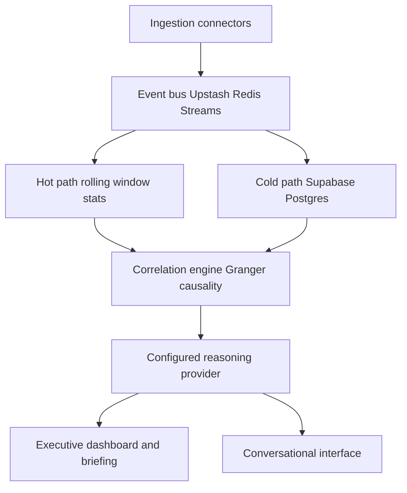
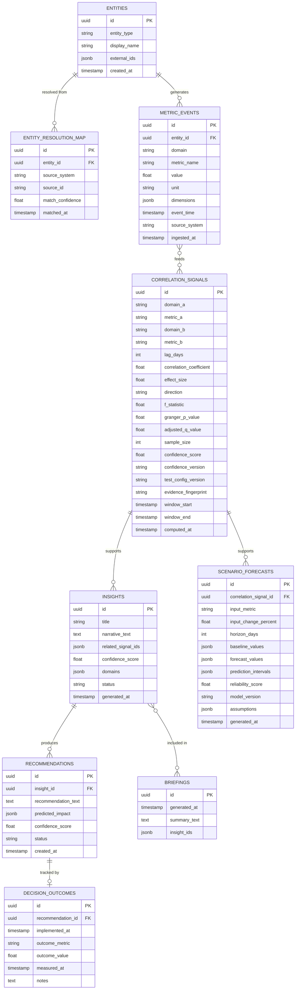

# MetricThread: Real-Time Enterprise Intelligence Agent
## Project Charter and Phase-Wise Build Plan

### Purpose of this document

This document is the single source of truth for the project across its full lifecycle. It exists for three reasons. First, it gives Codex a complete brief so the agent can research, refine, and build without guessing at intent. Second, it defines a phase structure where every sub-phase ends in testing and a documentation update, so the project never drifts ahead of its own record. Third, it is written to double as an interview preparation resource. Every architectural choice below is stated with its rationale and the alternatives that were considered, so any part of the system can be explained and defended later, not just described.

This document should be treated as living. Sections marked as living are expected to grow as phases complete.

---

## 1. Problem Statement

Enterprise data is fragmented across domain-specific systems: client data in a CRM, financial data in an ERP, partner performance in its own tracker, operational health in monitoring tools, competitive intelligence gathered informally, and compliance data held separately again. When an executive needs to answer a cross-domain question, such as why client acquisition cost is rising, the answer could originate in marketing, competitive pricing, partner referral quality, or product performance, and finding out requires manually pulling data from several systems and reconciling it by hand. By the time a report is compiled, the underlying data is already a week old, and the report answers what happened rather than what is happening now.

The core issue is that enterprises are data-rich but insight-poor. The data required to answer cross-domain questions already exists. What is missing is a layer that connects it, reasons over it in real time, and turns it into a specific, actionable recommendation rather than another dashboard.

## 2. Task and Category Fit

The build target is OpenAI Build Week, submitted under the Work and Productivity track, which covers tools that make teams and back-office operations faster and more effective through analytics and workflow automation. This problem statement fits that track directly: it is an analytics and decision-support tool for internal enterprise teams, not a consumer app, a developer tool, or an education product.

OpenAI Build Week judges submissions equally across Technological Implementation, Design, Potential Impact, and Quality of the Idea. The project must therefore prove all four: a real deterministic pipeline, grounded model integration, a coherent executive workflow, a specific VP-of-Growth problem, and a distinctive auditable decision loop. GPT-5.6 remains the intended OpenAI submission integration; Gemini 3.1 Flash-Lite is a clearly labelled free-tier development fallback while the OpenAI Platform account has no inference credit. Engineering time is still concentrated on the correlation and reasoning core, but the live product experience and reproducible submission evidence are first-class deliverables rather than polish deferred to the end.

Submission requirements to track through Phase 6: a working project built with Codex and GPT-5.6, the Work & Productivity category, a public or appropriately shared code repository, a README with setup instructions and sample data, a public YouTube demo under three minutes with audio explaining how Codex and GPT-5.6 were used, and the Codex `/feedback` session id from the session where the core functionality was built. The verified submission deadline is Tuesday, July 21, 2026 at 5:00 PM Pacific.

## 3. Expected Solution

The finished product should behave like a standing analytics function that never sleeps. It should notice a cross-domain predictive lead-lag relationship a human analyst would otherwise find only after days of manual correlation: in the initial synthetic scenario, declining partner referral quality predicts rising client acquisition cost three days later, with marketing spend shown as financial context. It should make the evidence, its computed confidence, and a specific recommended action visible rather than presenting a chart alone.

The differentiator against a generic BI dashboard with a chat layer bolted on is twofold. First, correlation is computed deterministically by a statistics layer before any language model reasons about it, so the system never asserts a relationship it has not actually found in the data. Second, every recommendation is tracked to an outcome, closing a feedback loop that most analytics tools never build, which is explicitly called out as a differentiator in the brief itself.

## 4. Guiding Design Principles

These principles are referenced throughout the rest of this document and should be checked against any new decision made during the build.

1. Correlation is deterministic, reasoning is interpretive. A statistics layer finds predictive lead-lag relationships in the data first. The language model explains their business relevance and recommends a controlled next step; it never asserts that the test proves causation.
2. Confidence is computed, not generated. Every insight and recommendation carries a numeric confidence score derived from correlation strength, data recency, and sample size, never a language model's self-reported certainty.
3. The schema is domain-agnostic. Data is stored in a generic, domain-tagged event model rather than one hardcoded table per business function, so adding a new domain is a schema addition, not a rewrite.
4. Every architectural choice favors free-tier infrastructure that maps cleanly onto its production equivalent, so nothing built during the hackathon needs to be thrown away later, only scaled up.
5. Every insight and every generated event is timestamped and stored, so system state is always replayable and auditable.

## 5. Scope for the Initial Build

Three domains are in scope for the first working version: Client, Financial, and Partner. They support a focused VP-of-Growth narrative without claiming an unmeasured competitor signal: partner referral quality predicts client acquisition cost at a three-day lag, and marketing spend provides financial context plus a constrained forecast input. Operational, Compliance, and Competitive intelligence extend naturally from the same schema and are scoped for later phases, described in Section 11.

Because no hackathon team has access to real, live CRM and ERP feeds, the initial build uses a deterministic synthetic dataset with known predictive relationships deliberately planted into it. It contains 180 daily observations across nine metrics, three per domain, a primary three-day partner-to-CAC relationship, a marketing-spend forecast relationship, and two known-unrelated negative controls. A seeded ground-truth manifest lets the tests verify the generator without exposing its answers to the reasoning layer. During the demo, a background simulator emits one compressed synthetic day every five seconds and the interface labels every result as a synthetic live simulation.

## 6. System Architecture

### 6.1 Pipeline overview

### 6.2 Component descriptions

**Ingestion connectors.** For the initial build this is the synthetic data generator and event simulator rather than real CRM or ERP connectors. It writes onto the same interface a real connector would use, so a Salesforce or SAP connector can be substituted later without changing anything downstream.

**Event bus.** An Upstash Redis Stream carries every new event. Separate hot and cold consumer groups read and acknowledge the same event independently; event IDs, pending-entry recovery, capped retention, and idempotent cold-path writes make drops visible and recoverable rather than silent.

**Hot path.** Maintains a rolling window of recent events in memory for immediate anomaly flags and live dashboard updates, so the interface visibly reacts within seconds of a new event.

**Cold path.** Persists every event to durable storage for historical trend analysis, the correlation engine's larger time windows, and audit purposes.

**Correlation engine.** Runs statistical tests, primarily Granger causality, across time-lagged series drawn from different domains to find genuine lead-lag relationships. This is the deterministic core of the system and the component that keeps the reasoning layer grounded.

**Reasoning layer.** Takes only a stored, validated evidence packet and produces a plain-language predictive narrative, a recommendation with a clearly labelled forecast, and references to the supporting signal IDs. It uses strict structured output, cannot change a deterministic confidence score, and powers the conversational interface and the scheduled morning briefing.

**Executive dashboard and briefing.** The primary interface for a non-technical executive: live charts driven by the hot path, a running list of insights, and a scheduled synthesis job that produces a short daily summary of what changed.

**Conversational interface.** A natural language layer over the same insight and event store, allowing follow-up questions and drill-downs rather than requiring a fresh query each time.

### 6.3 Why a hot path and cold path split

This is a right-sized version of the lambda architecture pattern used in real streaming systems. Running everything through a single database would either make the live dashboard slow, since every update would compete with historical analytical queries, or make the historical analysis shallow, since an in-memory-only system cannot hold enough history for meaningful trend detection. Splitting the two paths lets each be optimized for its own job without either compromising the other, and the pattern scales directly into production infrastructure, described in Section 11, without needing to be re-architected.

### 6.4 MVP API contract

The API stays intentionally narrow. `GET /agent/status` and `GET /metrics/live` supply the agent-status rail and rolling window; `GET /insights` and `GET /insights/{id}` supply the executive cards and Explain Why evidence. `POST /simulation/start` starts only the labelled synthetic simulator. `POST /recommendations/{id}/status` permits only `proposed`, `planned`, or `implemented`, while `POST /recommendations/{id}/outcomes` records a measured outcome without triggering an external action.

`POST /scenarios/forecast` accepts only `input_metric: "marketing_spend"`, `input_change_percent` in the inclusive range -20 to 20, and `horizon_days` from one to seven. Its response stores and returns the baseline, forecast, prediction interval, assumptions, reliability, model version, and supporting signal IDs. `POST /briefings/generate` provides a manual fallback for scheduled briefing generation. `POST /chat` retrieves only stored insights and signals; factual answers must include their IDs and unsupported questions return `no_evidence` rather than a speculative answer.

## 7. Tech Stack

| Layer | Choice | Rationale | Alternatives considered |
|---|---|---|---|
| Frontend | React with Vite, deployed on Vercel | Matches existing familiarity, free tier, fast iteration | Next.js was considered but adds server-side routing complexity not needed for a single-page dashboard |
| Backend | FastAPI, deployed on Render free tier | Async support fits an event-driven pipeline, minimal boilerplate | Django was considered and rejected as heavier than needed for an API-only service |
| Event bus and cache | Upstash Redis Streams, serverless free tier | Consumer groups let hot and cold consumers acknowledge the same event independently and recover pending events without silent loss | Kafka was considered and rejected for the initial build since it requires infrastructure a free tier cannot host cleanly, see Section 11 for the production path |
| Durable storage | Supabase Postgres | Relational model fits the domain-tagged event schema, generous free tier, already familiar from prior projects | A dedicated time-series database was considered and deferred, see Section 11 |
| Statistics engine | Python with statsmodels, Granger causality tests | A real, established technique for lead-lag relationships rather than relying on the language model to guess at causation | Simple Pearson correlation was considered and rejected since it cannot distinguish a genuine lead-lag relationship from coincidence |
| Reasoning and language layer | GPT-5.6 retained as the OpenAI submission path; Gemini 3.1 Flash-Lite as the active free-tier development fallback | Both paths receive the same validated evidence packet and strict output schema; the active provider is explicit configuration, never a silent substitution | A deterministic-only canned narrator was retained only for isolated UI tests and is not presented as model output |
| Data and pipeline generation | Codex | Required by the challenge, used to build the synthetic dataset, the event simulator, and the majority of the application code | None, this is a hard requirement of the challenge |

## 8. Data Model

The schema is deliberately generic. Rather than one table per business domain, most facts live in a single domain-tagged event table, so a new domain is a new value in a column, not a new table and a new set of joins.

Two tables carry most of the design intent and are worth explaining directly. `entity_resolution_map` exists so that the same client or partner appearing under different identifiers across source systems can be linked to one canonical `entities` row, which is the seed of a real entity resolution service described in Section 11. `decision_outcomes` exists so that a recommendation is not the end of the pipeline, its real-world result is recorded and can eventually be used to check whether the confidence scores the system produces are actually well calibrated. `correlation_signals` stores sufficient evidence to reproduce a statistical result, while `scenario_forecasts` stores a bounded, explicit assumption rather than an untraceable language-model prediction.

## 9. Key Design Choices and Alternatives

**Why deterministic statistics before language model reasoning, rather than asking the model to find patterns directly.** A language model asked to look at multiple time series and describe a relationship will produce a fluent answer whether or not a real relationship exists, since fluency and correctness are not the same property in a language model's output. Running a Granger non-causality test first means the system only asks the model to explain a stored predictive lead-lag signal that has passed a defined significance threshold. The interface and prompt never describe that signal as proof of causation. The alternative of relying purely on retrieval-augmented generation over raw event data was rejected for the core insight-generation path; structured filtering over stored signal and insight IDs is sufficient for the narrow conversational interface.

**Why Postgres for the cold path rather than a graph database or a dedicated time-series database.** At hackathon scale, the event volume and query patterns fit comfortably within a relational database with proper indexing. A dedicated time-series database such as TimescaleDB or ClickHouse becomes justified once query volume and cardinality grow past what a single Postgres instance can serve with acceptable latency, which is a production-scale concern addressed in Section 11 rather than a hackathon-week one. Introducing that complexity now would spend build time on infrastructure that the demo does not need.

**Why Redis Streams rather than Redis pub and sub or Kafka for the event bus.** Pub and sub cannot satisfy the Phase 2 requirement that no event be silently dropped when a consumer disconnects. Redis Streams provide separate hot and cold consumer groups, pending-entry recovery, acknowledgements, and retention controls while remaining feasible on Upstash's free tier. Kafka is still the production choice for high-volume partitioned replay, but it would consume build time better spent on the reasoning layer. The hackathon service uses non-blocking Stream reads over Upstash REST and treats each request as a bounded polling cycle, since the REST API does not support blocking `XREADGROUP`.

**Why synthetic data with planted predictive relationships rather than a public real-world dataset.** A public dataset would not contain a known, verifiable lead-lag relationship spanning the chosen domains, so there would be no way to confirm the correlation engine is actually working correctly before the live demo. A seeded generator, hidden ground-truth manifest, controlled noise, and known negative controls turn the demo into a reproducible claim: the system found the intended predictive signal without reporting unrelated pairs. The relationship remains a synthetic evaluation target, not proof that real-world causality has been established.

**Why confidence scores are computed from statistical properties rather than asked of the language model.** A language model can be prompted to state a confidence level, but that number reflects the model's fluency in producing a plausible-sounding figure, not a measured property of the underlying data. `confidence_v1` is a 0–100 score: 40% normalized adjusted-significance strength, 25% standardized incremental effect, 20% sample adequacy, and 15% event-time recency. The model can narrate this score but cannot alter it. The formula, component values, and version are stored with every signal.

**Why a constrained scenario forecast rather than a free-form what-if answer.** The initial product accepts only a marketing-spend change between -20% and +20% and a one-to-seven-day horizon. A deterministic, back-tested model produces a baseline, forecast interval, assumptions, and reliability score; GPT-5.6 may explain those stored values but may not invent an impact. This gives the demo a decision-support interaction without presenting a causal guarantee or an unconstrained synthetic prediction as enterprise advice.

**Why strict structured output and evidence IDs are required from the reasoning layer.** The Responses API supports JSON Schema-constrained structured output. Every reasoning response therefore requires the existing stored signal IDs, a narrative, an action, and a refusal state; server-side validation rejects an ID not present in the evidence packet. This is narrower than a general RAG system and directly supports the project's groundedness check.

**Why three domains at launch rather than all six named in the brief.** Equal judging weights make a coherent, reliable, and testable executive workflow more valuable than six shallow connections. Client, Financial, and Partner domains are enough to demonstrate the predictive relationship, constrained scenario, and action-outcome loop deeply. The schema is domain-agnostic so the remaining domains are a natural extension rather than a limitation, addressed in the phase plan below.

## 10. Phase-Wise Build Plan

Every phase below follows the same closing structure: build, test, document, then proceed. No phase is considered complete until its tests pass and its section of the decision log, described in Section 12, has been updated. Later phases extend the system built in earlier ones, they do not replace it.

### Phase 0: Research and Plan Refinement

Objective: validate the assumptions in this document against current best practice before writing application code.

Codex is expected to research, at minimum, current best practices and known pitfalls for Granger testing on short or noisy time series, patterns for an event-driven pipeline on free-tier serverless infrastructure, techniques for keeping a language model's output grounded in pre-computed statistical facts, and synthetic-dataset failure modes that make planted signals undetectable or trivial. Findings must refine the schema, phase plan, and testing criteria before Phase 1 begins. Phase 0 must also record the Build Week's current submission requirements, establish the product's predictive-not-causal language, replace Pub/Sub with Redis Streams, and define the deterministic confidence and scenario contracts.

Deliverable: a short research summary and decision entries appended to Section 13, plus the resulting edits to this document, made before any application code is written. This phase has no visual product demo; its demo is the rendered charter update and the cited research record.

### Phase 1: Foundation

Objective: a working schema, a synthetic dataset with a verifiable planted relationship, and a baseline entity resolution step, with no real-time behavior yet.

Deliverables: the Postgres schema from Section 8 deployed on Supabase, a deterministic synthetic dataset generator covering Client, Financial, and Partner domains with the documented primary lead-lag relationship, forecast relationship, and negative controls, plus a deterministic entity resolution step matching entities by exact key across the synthetic sources.

Testing: confirm the schema accepts and constrains data correctly, confirm the synthetic generator produces the planted relationship at a statistically detectable strength, confirm entity resolution correctly links every synthetic entity across domains with no false merges.

Documentation: a decision log entry explaining the specific predictive relationships and negative controls planted into the dataset, why they were selected, and why they must not be presented as real-world causation.

### Phase 2: Real-Time Pipeline

Objective: the event bus, hot path, and cold path from Section 6 are live and consuming the same event stream independently.

Deliverables: the event simulator appending to an Upstash Redis Stream, separate hot and cold consumer groups with idempotent cold persistence, a hot path maintaining a rolling window and exposing it to the dashboard, and an agent-status rail that visibly shows monitored metrics, ingestion, and signal status.

Testing: confirm an injected event appears in the hot path's rolling window at p95 within two seconds, confirm the same event lands in cold storage within ten seconds, and confirm 600 events at five per second are either acknowledged by both consumer groups or visibly recoverable, with no silent drops.

Documentation: a decision log entry recording the measured latency and any tuning applied to the rolling window size.

### Phase 3: Correlation Engine

Objective: the statistics layer runs Granger causality tests across the three domains and produces scored correlation signals.

Deliverables: a scheduled or event-triggered job that aligns daily series, checks stationarity, differences when required, chooses lag by BIC up to seven days, applies Benjamini-Hochberg correction across the run, and writes reproducible evidence plus `confidence_v1` to `correlation_signals`.

Testing: confirm the engine detects the planted partner-referral-quality-to-CAC relationship with at least 60 usable observations and q <= 0.05, and confirm it does not report either known-unrelated pair after adjustment.

Documentation: a decision log entry stating the stationarity treatment, BIC lag selection, significance threshold, confidence formula, and negative-control result.

### Phase 4: Reasoning and Recommendation Layer

Objective: the configured reasoning provider turns correlation signals into narrated insights and recommendations with predicted impact. GPT-5.6 remains the intended OpenAI Build Week submission path; Gemini may be used only as a clearly documented development fallback when OpenAI inference credit is unavailable.

Deliverables: provider-specific structured-output requests that supply the model only with a validated evidence packet, never raw unfiltered event data, and use strict JSON Schema output for a narrative, recommendation, cited signal IDs, and a refusal state. The deterministic confidence score is passed through unchanged. The executive interface includes an Explain Why view with signal ID, lag, p/q values, sample size, confidence decomposition, and supporting timestamps, plus the recommendation lifecycle and outcome entry.

Testing: confirm every generated insight cites a stored correlation signal, reject an output containing an unknown ID, confirm the model returns no evidence when no signal exists, and confirm recommendations include a specific human-controlled action rather than a general observation.

Documentation: a decision log entry with the final evidence schema, prompt structure, model configuration preflight, and at least one rejected ungrounded prompt approach.

### Phase 5: Conversational Interface and Briefing

Objective: an executive can ask a grounded follow-up question, generate a daily summary on demand if scheduling is unavailable, and run one explicit scenario forecast.

Deliverables: a chat endpoint that retrieves stored insights and correlation signals through structured filtering and cites their IDs in every factual answer, a scheduled briefing job with a manual Generate now fallback, and a scenario endpoint limited to a marketing-spend change between -20% and +20% over one to seven days. The scenario returns deterministic baselines, forecast intervals, assumptions, and reliability rather than a language-model estimate.

Testing: confirm a follow-up question correctly retrieves the same cited insight from the previous turn, confirm unsupported questions refuse, confirm the briefing includes only genuinely new material, and confirm the held-out synthetic scenario returns the predefined forecast direction and interval.

Documentation: a decision log entry describing the structured retrieval strategy, briefing fallback, scenario scope, and the decision not to make a causal claim.

### Phase 6: Demo Readiness, Deployment, and Submission

Objective: the system is deployed on the free-tier stack from Section 7, the demo runs live in front of judges, and all submission requirements from Section 2 are satisfied.

Deliverables: production deployment on Vercel, Render, Supabase, and Upstash; a seeded read-only judge experience; a README with setup instructions, sample data, evidence semantics, and an honest Codex/GPT-5.6 collaboration record; a public YouTube demo under three minutes covering how Codex and GPT-5.6 were used; and the Codex `/feedback` session id.

Testing: a full end-to-end rehearsal of the live demo, including the event simulator running continuously, to confirm nothing breaks under the exact conditions of the presentation.

Documentation: a final pass over the entire decision log to confirm every phase's entries are complete before submission.

### Manual prerequisites by phase

Codex must pause at each unmet prerequisite rather than inventing credentials or substitutes. Before Phase 1, create a Supabase project and provide `DATABASE_URL` from **Project Settings → Database**; this unblocks schema deployment and durable event tests. Before Phase 2, create an Upstash Redis database and provide `UPSTASH_REDIS_REST_URL` plus `UPSTASH_REDIS_REST_TOKEN` from its database details page; this unblocks the bounded Stream consumers. Before Phase 4, either provide an OpenAI Platform key plus verified `OPENAI_REASONING_MODEL` for the retained GPT-5.6 path, or, for the documented free-tier development fallback, set `AI_PROVIDER=gemini`, `GEMINI_API_KEY`, and `GEMINI_MODEL=gemini-3.1-flash-lite`; these values are deployment-only `.env` configuration. Before Phase 6, restore and verify a funded OpenAI reasoning call if the submission claims live GPT-5.6 output, create the Vercel and Render deployment projects, configure the same applicable variables, and upload the public YouTube demo; these actions unblock judge access and submission.

The workspace is not yet a Git repository. Once the Phase 0 summary is approved, initialize and synchronize it with the existing public remote while preserving its MIT license; then commit and push only the approved Phase 0 work. The existing Devpost draft is updated only after the Phase 6 artifacts are ready and explicit authorization is given.

## 11. Production Improvement Roadmap

This section exists so that every free-tier or scoped-down choice made for the hackathon has a stated upgrade path. Nothing in this list is a rejection of an idea, it is the next phase for a version of the product used by a real enterprise at real data volume.

| Hackathon component | Production upgrade | Why it becomes necessary |
|---|---|---|
| Upstash Redis Streams | Kafka or a managed equivalent such as Confluent Cloud or AWS MSK | Real enterprise event volume needs durable replay, partitioning, and independent consumer scaling beyond a bounded Redis Stream |
| Supabase Postgres as the sole store | Postgres retained for entities and relationships, paired with ClickHouse or TimescaleDB for high-cardinality time-series analytics | A single Postgres instance degrades on analytical queries once event volume passes tens of millions of rows |
| Deterministic key-based entity resolution | A learned matching service, for example using an embedding-based matcher or a tool such as Splink, run incrementally | Real source systems rarely share a clean key, matching the same client across five real systems is itself a hard, high-value problem |
| In-process statistics computation | A feature store such as Feast paired with scheduled batch jobs through Airflow or Dagster | Rolling statistics over a real enterprise's full entity set need a dedicated compute layer rather than a single process |
| One GPT-5.6 call per insight | Tiered model routing, with smaller models handling triage and classification and GPT-5.6 reserved for final narrative synthesis | Controls cost at volume, since not every event requires frontier-model reasoning |
| Single-tenant data model | Row-level tenant isolation built into the schema from the start | Serving more than one enterprise customer makes multi-tenancy a requirement, not an enhancement |
| No authentication or audit trail | Role-based access control, encryption at rest, and a full audit log on every insight and recommendation | Non-negotiable once the data includes real financial and compliance information |
| Manual review of recommendation outcomes | An automated calibration check comparing predicted confidence to actual outcome, feeding back into the confidence scoring model | This is what actually closes the learning loop the product promises, turning the decision outcomes table from a record into an active input |
| Real ingestion connectors | Purpose-built adapters for common CRM, ERP, and support platforms, or an integration framework such as Airbyte | The synthetic generator is a stand-in for this and was always intended to be replaced, not extended |

## 12. Testing Protocol

Every sub-phase in Section 10 is closed out using the same four checks, applied to whatever that phase built.

1. Correctness check: does the component do what it was specified to do, verified against a known input where the expected output is known in advance, such as the planted predictive relationship.
2. Negative control: does the component correctly decline to report something when nothing is actually there, such as the correlation engine staying silent on two unrelated series.
3. Latency and reliability check: for anything in the real-time path, does it meet a stated latency budget and survive a sustained load without dropping events.
4. Groundedness check: for anything produced by the reasoning layer, is every claim traceable to a specific stored fact, not an unsupported assertion.

A phase is not complete until all four checks that apply to it have passed and the result, including any failure and how it was resolved, is recorded in the decision log.

The initial acceptance targets are: zero silent losses over 600 events injected at five events per second; p95 ingest-to-dashboard visibility of two seconds or less; cold-path persistence within ten seconds; the planted partner-referral-quality-to-CAC signal at q <= 0.05; no accepted signal for the two declared unrelated pairs; a stored evidence ID behind every language-model factual claim; an explicit no-evidence result for unsupported questions; and the expected held-out direction plus interval for the constrained scenario. These targets are verification requirements, not claims of production scale.

## 13. Decision Log and Documentation Protocol

This section is the living record referenced throughout this document and is the part intended to double as interview preparation. Each entry should follow the same structure, so that any decision in the finished system can be looked up and explained on demand.

Entry format:

- Decision: what was decided
- Context: what problem or requirement prompted the decision
- Options considered: the realistic alternatives, including ones already discussed in Section 9
- Choice made: which option was taken
- Rationale: why, specifically, tied to the constraints of this project
- Trade-offs accepted: what was given up by not choosing an alternative
- Revisit trigger: the condition under which this decision should be reconsidered, for example a specific data volume or a specific production requirement

Entries should be added at the end of every phase in Section 10, never batched at the end of the project. A decision made under time pressure during the hackathon is still recorded with its real rationale, including if that rationale is simply that the alternative would not fit in the available time, since that is itself a legitimate and defensible engineering trade-off.

Phase 0 research summary and any resulting plan changes are recorded here first, before Phase 1 begins.

### Phase 0 Research Summary — 2026-07-14

Research was completed before application code. The official Devpost challenge data confirmed the Work & Productivity fit, equal judging criteria, the July 21 5:00 PM Pacific deadline, the required public or shared repository, README/sample data/run instructions, public sub-three-minute YouTube demo with Codex and GPT-5.6 voiceover, and required `/feedback` session ID. The current model guidance identifies `gpt-5.6` as an alias for `gpt-5.6-sol`, with `gpt-5.6-terra` and `gpt-5.6-luna` as lower-cost variants, and recommends Responses API use for reasoning workflows. The exact configured model will still be validated before API use rather than assumed from documentation alone.

For the correlation engine, the `statsmodels` Granger test evaluates whether the second, fully observed series improves prediction of the first series at selected lags; it does not establish real-world causation. The ADF test supports the chosen unit-root check before Granger analysis. Multiple series comparisons require adjusted rather than raw p-values, so the implementation will use Benjamini-Hochberg correction. Upstash documents consumer-group Stream reads, acknowledgements, and recovery of pending entries; its REST API supports Streams but not blocking `XREAD` or `XREADGROUP`, which supports bounded polling rather than an assumed permanent blocking worker. OpenAI Structured Outputs supports strict JSON Schema, enabling server-side validation of model-provided evidence IDs.

Research sources: [Devpost challenge requirements](https://openai.devpost.com/), [GPT-5.6 model guidance](https://developers.openai.com/api/docs/guides/latest-model?model=gpt-5.6), [Structured Outputs](https://developers.openai.com/api/docs/guides/structured-outputs), [statsmodels Granger test](https://www.statsmodels.org/stable/generated/statsmodels.tsa.stattools.grangercausalitytests.html), [ADF test](https://www.statsmodels.org/stable/generated/statsmodels.tsa.stattools.adfuller.html), [multiple-test adjustment](https://www.statsmodels.org/stable/generated/statsmodels.stats.multitest.multipletests.html), [Upstash Streams consumer groups](https://upstash.com/docs/redis/sdks/ts/commands/stream/xreadgroup), and [Upstash REST compatibility](https://upstash.com/docs/redis/features/restapi).

### Phase 0 Decision Log

#### Decision: Position the project as MetricThread in Work & Productivity

- Decision: Use MetricThread as the working product name and submit under Work & Productivity.
- Context: The product needs a memorable identity while fitting the hackathon's analytics, sales, and back-office category.
- Options considered: A generic Enterprise Intelligence Agent name; a causality-themed product name; MetricThread.
- Choice made: MetricThread, with the tagline “Grounded cross-functional intelligence for auditable business decisions.”
- Rationale: The name emphasizes connected metrics without implying that the product proves causality. Work & Productivity explicitly includes analytics and back-office operations.
- Trade-offs accepted: This is a working product name, not trademark or domain clearance.
- Revisit trigger: A clearance issue or a materially better name selected before public branding is recorded.

#### Decision: Correct the judging model and make submission evidence a build artifact

- Decision: Treat technical implementation, design, potential impact, and idea quality as equal requirements; preserve dated implementation and decision evidence throughout the project.
- Context: The charter's prior weighting was inconsistent with the current official challenge data.
- Options considered: Continue optimizing mostly for correlation depth; distribute work equally without a submission-evidence record; distribute work equally with an evidence record.
- Choice made: Equal-criteria delivery with a README, demo script, dated phase commits after approval, collaboration record, and `/feedback` capture in Phase 6.
- Rationale: The submission requires both a working product and clear evidence of Codex and GPT-5.6 use, so documentation cannot be deferred.
- Trade-offs accepted: Some build time is reserved for reproducibility and narration rather than adding extra domains.
- Revisit trigger: A verified Devpost rule or field changes before submission.

#### Decision: Keep a three-domain synthetic VP-of-Growth MVP and speak only of predictive lead-lag

- Decision: Use Client, Financial, and Partner data; make declining partner referral quality predicting CAC at a three-day lag the hero signal.
- Context: The original competitor-pricing illustration would require a fourth domain not in the initial scope, and Granger testing does not prove causation.
- Options considered: Add Competitive Intelligence now; retain the three domains with a causal claim; retain the three domains with predictive language.
- Choice made: Retain three domains, show marketing spend as context and constrained forecast input, and reserve Competitive Intelligence for the roadmap.
- Rationale: This produces a focused, testable story and prevents overclaiming from a predictive statistical test.
- Trade-offs accepted: The first demo does not model competitor actions or real enterprise data.
- Revisit trigger: A later phase has verified competitive data and a method appropriate for analysing it.

#### Decision: Use seeded synthetic data, hidden ground truth, and declared negative controls

- Decision: Generate 180 daily observations across nine metrics with deterministic seeds, known signal relationships, and two unrelated pairs.
- Context: A live demo needs repeatable statistical evidence, and a random or uncontrolled generator can hide or trivialize the signal.
- Options considered: Public data; random synthetic data; seeded synthetic data with a separate truth manifest and controls.
- Choice made: Seeded synthetic data with noise calibrated through tests, a private test fixture manifest, and explicit synthetic labels in the UI.
- Rationale: The engine can be evaluated against known expected outcomes without leaking answers into the reasoning prompt.
- Trade-offs accepted: The data illustrates methodology rather than external business truth.
- Revisit trigger: A governed, representative real dataset becomes available with permission and validation criteria.

#### Decision: Replace Redis Pub/Sub with Upstash Redis Streams

- Decision: Use one Stream with independent `hot` and `cold` consumer groups, acknowledgements, pending-entry recovery, capped retention, and idempotent database writes.
- Context: Phase 2 requires a no-silent-drop reliability check, which Pub/Sub cannot provide for disconnected consumers.
- Options considered: Redis Pub/Sub; Redis Streams; Kafka or a managed Kafka service.
- Choice made: Redis Streams, consumed through bounded non-blocking REST polling in the hackathon deployment.
- Rationale: Streams expose acknowledgement and recovery semantics while remaining appropriate for the free-tier demonstration. Upstash REST does not support blocking Stream reads, so long-lived blocking behavior will not be assumed.
- Trade-offs accepted: The event log is intentionally bounded and not a production-scale replay system.
- Revisit trigger: Sustained volume, retention requirements, or consumer concurrency exceed the demonstrable Stream configuration.

#### Decision: Make statistical evidence and confidence fully deterministic

- Decision: Require at least 60 usable daily observations, ADF stationarity checks and differencing where needed, BIC-selected lags up to seven, Benjamini-Hochberg q <= 0.05, and `confidence_v1` with 40/25/20/15 weights.
- Context: Raw p-values across many pairs and an LLM-generated confidence statement would make the result hard to defend.
- Options considered: Pearson correlation; raw Granger p-values; adjusted Granger evidence with deterministic confidence.
- Choice made: Adjusted Granger evidence and the versioned confidence formula described in Section 9.
- Rationale: Each displayed score can be recalculated from persisted evidence, and the declared negative controls test the threshold directly.
- Trade-offs accepted: A small synthetic dataset may yield fewer accepted signals than a more permissive threshold.
- Revisit trigger: Backtests show that the declared false-positive or false-negative behavior is unsuitable for the demo.

#### Decision: Constrain GPT-5.6 to evidence-grounded, schema-validated reasoning

- Decision: Use Responses API strict JSON Schema output containing only stored signal IDs, narrative, recommendation, and refusal status; invoke the model only for a newly accepted or materially changed signal, a briefing, or an explicit chat request.
- Context: The project requires GPT-5.6 while preventing the model from inventing evidence or controlling computed confidence.
- Options considered: Raw-event prompting; free-form text over signal summaries; strict evidence-packet output with server validation.
- Choice made: Strict evidence-packet output and structured retrieval, with the configured model checked against available API access before live calls.
- Rationale: This preserves the deterministic-first principle, controls free-tier/API usage, and makes unsupported questions refuse cleanly.
- Trade-offs accepted: The chat experience cannot perform open-ended raw-data analysis in the MVP.
- Revisit trigger: A later evaluation demonstrates safe, measurable benefit from a broader retrieval layer.

#### Decision: Limit what-if analysis to a deterministic marketing-spend scenario

- Decision: Support only a -20% to +20% marketing-spend change and a one-to-seven-day horizon, returning stored baselines, intervals, assumptions, and reliability.
- Context: The proposed simulator is compelling but a free-form model answer would be an unsupported causal recommendation.
- Options considered: No what-if feature; free-form GPT what-if answers; one bounded statistical scenario.
- Choice made: One bounded, back-tested scenario with GPT explanation only.
- Rationale: The feature adds an executive decision interaction while keeping every numerical output reproducible and qualified.
- Trade-offs accepted: The MVP cannot model arbitrary interventions or promise actual business impact.
- Revisit trigger: Forecast evaluation supports a broader, governed input surface.

#### Decision: Preserve phase approvals and use a free-tier-aware Codex workflow

- Decision: Complete one approved phase at a time; use one core implementation task per phase, narrow reviews only for research or focused diagnosis, and record actual test results before each approval request.
- Context: The project must remain thorough under variable Codex free-tier limits and the local workspace is not yet a Git repository.
- Options considered: Parallel full-system implementation; one large end-of-project commit; gated phase delivery with small, verified tasks.
- Choice made: Gated phase delivery. After Phase 0 approval only, initialize and synchronize the local repository with the existing MIT-licensed remote, then commit and push the approved Phase 0 work alone.
- Rationale: It preserves the charter's documentation/approval contract, reduces wasted context, and creates a credible Build Week record.
- Trade-offs accepted: External infrastructure and later features wait for the documented gate rather than being pre-built speculatively.
- Revisit trigger: The user explicitly changes the approval workflow or the deadline makes the documented process impossible to complete.

### Phase 1 Foundation Results — 2026-07-14

The Supabase `public` schema contains all nine planned tables. The manually applied, idempotent seed loaded three canonical entities, six exact-key source mappings, and 1,620 synthetic daily metric events from 2026-01-01 through 2026-06-29. The persisted primary check paired 177 days and measured a three-day lagged Pearson correlation of -0.9953 from partner referral quality to client acquisition cost. The declared negative controls remained weak: partner active rate to recognized revenue was 0.0288, and partner incentive budget to qualified leads was -0.0396. Each canonical entity had exactly two source mappings at confidence 1.0.

Schema inspection confirmed the database enforces the `entity_resolution_map (source_system, source_id)` unique constraint, the `metric_events (entity_id, metric_name, event_time, source_system)` unique constraint, both required entity foreign keys, non-empty source and metric fields, a 0-to-1 entity-match confidence, and JSON-object dimensions. The local test command returned `4 passed, 1 skipped`; the skipped test is the external database integration fixture because the Supabase Shared Pooler closed connections from this environment before authentication. The same schema, seed, and data-quality checks were instead executed through the Supabase SQL Editor and their actual results are recorded above. Latency/reliability is not applicable until the Phase 2 streaming path exists, and groundedness is not applicable until the Phase 4 reasoning layer exists.

#### Decision: Use deterministic South-region synthetic signals with explicit negative controls

- Decision: Seed 180 days of nine synthetic metrics across Client, Financial, and Partner domains, with partner referral quality leading client acquisition cost by three days and two declared unrelated controls.
- Context: Phase 1 requires reproducible data that can demonstrate a non-trivial cross-domain relationship without implying real enterprise behavior or causality.
- Options considered: Random independent series; a public business dataset with unknown ground truth; deterministic synthetic series with declared signal and control pairs.
- Choice made: Deterministic synthetic series labelled with `simulation: synthetic`, plus the primary relationship and two negative controls verified against the persisted data.
- Rationale: The primary relationship was strongly detectable at -0.9953 over 177 paired days while both controls remained near zero, making later statistical-engine behavior testable. These values are an evaluation fixture and evidence of a predictive lead-lag pattern, not proof of a real-world causal mechanism.
- Trade-offs accepted: The deliberately clear synthetic relationship is stronger and cleaner than real enterprise data, so the demo illustrates auditability rather than production predictive accuracy.
- Revisit trigger: Replace or recalibrate the generator when governed representative data and a documented backtesting protocol are available.

#### Decision: Add an idempotent SQL Editor seed fallback for the Phase 1 manual gate

- Decision: Add `db/seed_foundation.sql` as a Supabase SQL Editor fallback while retaining the Python migration and seed path as the normal application path.
- Context: The external Shared Pooler resolved but closed connections from this Codex environment before authentication, while the Supabase SQL Editor successfully executed the same schema and seed operations.
- Options considered: Wait indefinitely for pooler access; bypass Supabase verification; provide an idempotent SQL Editor fallback alongside the application seed code.
- Choice made: Use the SQL Editor fallback only to execute and verify the Phase 1 database setup, with stable synthetic labels and natural-key upserts to make reruns safe.
- Rationale: It preserves the real Supabase deployment, provides direct database constraint evidence, and avoids storing credentials or weakening the schema solely to accommodate a connectivity issue.
- Trade-offs accepted: The fallback's deterministic SQL values are implementation-equivalent but not byte-for-byte identical to Python's seeded pseudo-random values; the Python generator remains the canonical application-side fixture.
- Revisit trigger: Restore the automated integration fixture as the authoritative deployed-database test when pooler connectivity is available from the build environment.

### Phase 2 Live Pipeline Results — 2026-07-14

The Phase 2 implementation added an Upstash Redis Stream, independent `metricthread-hot` and `metricthread-cold` consumer groups, a 90-event hot rolling window, an idempotent Supabase Data API cold sink, recovery via `XAUTOCLAIM`, and a React/Vite status rail backed by `GET /agent/status`, `GET /metrics/live`, and `POST /simulation/start`. The simulator emits one labelled synthetic day (nine events) every five seconds. A distinct worker polls while the simulation is active so dashboard visibility is not delayed by the simulator cadence.

The live reliability rehearsal invoked `uv run python -m scripts.phase2_rehearsal` with a unique temporary Stream. It injected 600 events over exactly 120.00 seconds (5.00 events/second), recorded 600 hot-path deliveries and 600 durable cold-path writes, left zero pending entries in both consumer groups, and measured p95 hot visibility at 719.55 ms and p95 cold persistence at 1,231.95 ms. The temporary Stream was deleted after the run. Before the server-side Supabase key was configured, an intentional cold-path failure left events unacknowledged in the cold consumer group's pending-entry list while the hot group remained fully acknowledged; this behavior is covered by the automated negative-control test and was visible in the status rail rather than becoming a silent drop. A first live status request initially attempted to query pending counts before groups existed and returned HTTP 500; the implementation was corrected to report zero pending before the simulator starts, then rechecked successfully.

The root test command returned `8 passed, 1 skipped` plus one upstream FastAPI TestClient deprecation warning, and the React production build succeeded. The skipped integration fixture remains the unavailable raw Postgres TCP path. The Data API preflight and the full cold-write rehearsal both succeeded with a server-only Supabase secret key; no credentials were added to the repository. Groundedness is not applicable until the Phase 4 reasoning layer. The running React dashboard was verified in a browser: it loaded without a Vite error overlay, exposed the Start simulation control, transitioned to Monitoring 9 business metrics, and rendered all nine metric cards after live events arrived.

#### Decision: Use one capped Redis Stream with two independent consumer groups and acknowledge only completed work

- Decision: Use `metricthread:events` with approximate `MAXLEN ~ 2000` retention, separate hot and cold consumer groups, acknowledgement after hot-state application or durable cold persistence, and `XAUTOCLAIM` recovery after 60 seconds idle.
- Context: The Phase 2 pipeline must make every event independently visible to the low-latency dashboard and durable store without silent loss when a consumer fails.
- Options considered: Redis Pub/Sub; one shared consumer group; two independent Redis Stream groups; a Kafka deployment.
- Choice made: Two independent Redis Stream consumer groups with non-blocking REST polling, pending-entry tracking, and recovery.
- Rationale: The measured 600-event rehearsal delivered all events to both paths with zero pending entries after drain. Keeping an event pending on cold-write failure makes recovery observable and testable rather than dropping data.
- Trade-offs accepted: The capped Stream is a bounded demo retention log rather than a long-term enterprise replay system, and REST polling is active only during the synthetic simulation to conserve free-tier command usage.
- Revisit trigger: Consumer concurrency, retention needs, or sustained production traffic require partitioned durable replay infrastructure such as Kafka.

#### Decision: Separate one-second stream processing from the five-second synthetic simulator cadence

- Decision: Run the bounded consumer worker every second while the simulator emits a compressed synthetic day every five seconds.
- Context: Tying processing to simulator emissions could produce dashboard visibility near five seconds, violating the two-second Phase 2 target.
- Options considered: Process only after each simulated day; use a permanent blocking read; use a bounded worker loop independent of emission.
- Choice made: A one-second worker loop using non-blocking `XREADGROUP`, with recovery scans bounded to the configured idle interval.
- Rationale: The live rehearsal achieved 719.55 ms p95 hot visibility while retaining the required five-second visual simulator cadence. Upstash REST does not support blocking `XREADGROUP`.
- Trade-offs accepted: Polling incurs command costs during an active demo, so the worker is not left running after the finite simulation completes.
- Revisit trigger: A deployed workload needs always-on monitoring or the free-tier command budget is exceeded.

#### Decision: Use the server-side Supabase Data API sink when direct Postgres TCP is unavailable

- Decision: Prefer `SUPABASE_URL` plus `SUPABASE_SECRET_KEY` for the backend cold sink when configured, otherwise fall back to `DATABASE_URL` through psycopg.
- Context: The Supabase SQL Editor and Data API were healthy, but raw Postgres TCP connections from the build environment were reset before authentication.
- Options considered: Treat cold writes as successful without storage; wait for TCP connectivity; use the server-side Supabase Data API with idempotent natural-key upserts.
- Choice made: A backend-only Data API sink using `on_conflict=entity_id,metric_name,event_time,source_system` and merge-duplicate preference.
- Rationale: The preflight read and 600-event durable-write rehearsal succeeded without exposing a key to the React client or repository. Natural-key upserts tolerate simulator replay and preserve idempotency even when an existing synthetic row has a different UUID.
- Trade-offs accepted: A secret key bypasses Row Level Security and must be protected as deployment-only configuration; the demo is single-tenant and has no user authorization model yet.
- Revisit trigger: Production authentication, tenant isolation, or a reliably reachable Postgres connection changes the appropriate persistence boundary.

### Phase 3 Deterministic Signal Engine Results — 2026-07-14

The Phase 3 implementation added `002_signal_engine.sql`, a deterministic daily-series engine, an authenticated Supabase Data API signal repository, `GET /signals`, and `POST /signals/run`. Each run rejects duplicate, missing, non-finite, or non-contiguous daily series; requires at least 60 usable observations; runs ADF with BIC-selected lags through seven and applies one first difference only when needed; selects a bivariate VAR order by BIC; tests the selected order with the SSR F-test; and applies Benjamini-Hochberg correction once across the predeclared 54 directed cross-domain candidate pairs. Only q <= 0.05 evidence is retained. Each retained row includes p, q, F-statistic, incremental delta-R-squared effect, model observations, transformations and ADF p-values, deterministic confidence components, a data digest, and a stable fingerprint. The React dashboard now exposes an evidence table and explicitly calls each displayed relationship predictive evidence rather than causation.

The manually applied Phase 3 migration completed in the Supabase SQL Editor with `Success. No rows returned`. The first real signal run then correctly revealed a data-fixture defect: the SQL Editor seed fallback had substituted shared sine-wave terms for the canonical Python generator's seeded Gaussian noise. It returned 15 accepted pairs, including the declared `partner_active_rate -> recognized_revenue` negative control. This was not accepted as a statistical-engine success. The canonical 1,620-event Python fixture was synchronized through the authenticated Data API under the existing natural key, prior engine evidence was reconciled, and the analysis was rerun. The corrected real results were 54 candidates, four accepted signals, and 50 rejected candidates. The primary `partner_referral_quality -> client_acquisition_cost` evidence had q = 5.87e-54, F-test model observations = 174, BIC-selected history = five days, incremental effect = 0.58287 delta-R-squared, and confidence = 99.33. Its source and target were first-differenced after non-stationary raw ADF results. The two declared controls were absent from persisted evidence and failed correction at q = 0.572 (`partner_active_rate -> recognized_revenue`) and q = 0.762 (`partner_incentive_budget -> qualified_leads`).

Two complete real Supabase read/analyze/reconcile/persist runs took 3.340 seconds and 2.587 seconds respectively and produced identical evidence fingerprints. The repository contained exactly four persisted signals after reconciliation. The final `./scripts/test` run returned `15 passed, 1 skipped`; the skipped test remains the unavailable raw Postgres TCP fixture, and one upstream FastAPI TestClient deprecation warning remains. The frontend production build passed. A browser test against the real Supabase-backed local API loaded without a Vite overlay or connection error, showed the four persisted rows, and successfully invoked `POST /signals/run` through the “Run evidence analysis” control. Groundedness is not applicable until Phase 4, because no GPT reasoning is invoked or displayed in this phase.

#### Decision: Use a full directed cross-domain candidate family with correction and explicit non-causal language

- Decision: Evaluate all 54 directed pairs formed by the nine metrics across different domains, then retain only Benjamini-Hochberg corrected q <= 0.05 evidence.
- Context: The product must discover cross-functional signals automatically while controlling the false-discovery risk inherent in testing many pairs.
- Options considered: Test the hero pair only; tune or blacklist known controls; evaluate the predeclared full cross-domain family with correction.
- Choice made: Evaluate the full 54-pair candidate family and persist only corrected evidence, including secondary or mediated-looking predictive signals.
- Rationale: The corrected real run retains the primary signal and three additional predictive relationships while rejecting both declared controls. This is more auditable than making the test family depend on the desired demo result.
- Trade-offs accepted: Bivariate testing can retain relationships driven by an omitted common factor or mediation, so a retained signal is not a unique business driver and must not be narrated as a root cause.
- Revisit trigger: A governed multivariate model and out-of-sample evaluation demonstrate a material reduction in false or redundant signals.

#### Decision: Treat BIC order as model history, not an asserted business delay

- Decision: Present the BIC-selected order as “BIC model history” and store it as test configuration metadata; do not present it as the exact day on which a business outcome occurs.
- Context: The synthetic generator plants a three-day quality-to-CAC relationship, while the statistically selected VAR order is five because it jointly evaluates history through that order.
- Options considered: Display five days as the business delay; force the test to three days; disclose the selected order's actual interpretation.
- Choice made: Display “five days” only as selected model history and keep the data-generation lag in test-fixture documentation.
- Rationale: This distinguishes a joint predictive test configuration from a causal or point-delay claim and preserves the BIC guardrail rather than tailoring the method to the demo.
- Trade-offs accepted: The executive UI is more statistically precise but requires a short explanation.
- Revisit trigger: A future lag-specific effect decomposition is validated and can be presented without overstating certainty.

#### Decision: Synchronize the canonical Python fixture and reconcile stale current-engine evidence

- Decision: Keep the SQL Editor script as a bootstrap fallback, then use the server-side Supabase Data API to upsert the exact canonical Python fixture before signal analysis; delete prior evidence for the same test-configuration version before inserting the current run.
- Context: The dashboard SQL fallback's smooth deterministic substitutes caused 15 accepted signals, including a declared negative control, whereas the canonical seeded generator produces four corrected signals and rejects both controls.
- Options considered: Weaken the q threshold; blacklist the failed control; rerun the SQL fallback with a tuned formula; synchronize the canonical fixture and remove stale evidence.
- Choice made: Synchronize all 1,620 canonical events in 100-row idempotent batches and reconcile the current engine-version evidence on every analysis run.
- Rationale: The corrected data produced four persisted signals and restored both negative controls, without changing the statistical threshold or hiding failed evidence.
- Trade-offs accepted: Current-engine evidence history is replaced rather than retained as a full analysis-run lineage. This is safe before recommendations and scenario records reference signal IDs, but it is not a production audit-history design.
- Revisit trigger: Before a later phase creates dependent records, add analysis-run versioning and stale/superseded evidence state instead of deleting prior rows.

#### Decision: Compute and persist `confidence_v1` independently of narrative systems

- Decision: Score accepted evidence with 40% adjusted-significance strength, 25% standardized incremental effect, 20% sample adequacy, and 15% synthetic-event recency; persist all four components with the score.
- Context: The user must be able to audit why the primary evidence receives 99.33 confidence without an LLM altering the calculation.
- Options considered: A single opaque score; a free-form model confidence; a versioned formula with persisted components.
- Choice made: The versioned deterministic formula, normalized with -log10(q) capped at four, delta-R-squared capped at 0.25, 180-event sample adequacy, and a synthetic event-time recency reference.
- Rationale: Repeated real runs produced identical fingerprints and scores, so the dashboard and later GPT narration have a stable evidence boundary.
- Trade-offs accepted: The normalization constants are calibrated for this 180-day synthetic fixture and need empirical recalibration for governed production data.
- Revisit trigger: Backtesting on representative history produces a documented calibration curve or shows that confidence is systematically miscalibrated.

### Phase 4 Reasoning and Recommendation Layer Results — 2026-07-15

Phase 4 added an evidence-grounded insight service, Supabase-backed persistence for `insights`, `recommendations`, and `decision_outcomes`, `GET /insights`, `GET /insights/{id}`, `POST /insights/generate`, `POST /recommendations/{id}/status`, and `POST /recommendations/{id}/outcomes`. The service selects only a newly accepted persisted signal, passes the model a compact evidence packet rather than raw events, requires a single cited signal ID, preserves the stored deterministic confidence score, and creates recommendations in `proposed` status. The provider is explicit local configuration: the existing OpenAI Responses implementation remains available, while `AI_PROVIDER=gemini` selects Gemini 3.1 Flash-Lite through its structured-output API. The `.env` is ignored by Git and contains no repository-tracked credentials.

The OpenAI model preflight previously succeeded, but its first live inference attempt returned `429 insufficient_quota`; no GPT narrative was persisted. The user provided a Gemini development key after confirming that the OpenAI account had no remaining credits. Gemini model preflight then succeeded. The first live Gemini output was rejected before persistence because the server validator had incorrectly required the literal word `predictive`, although the documented prompt also allows the phrase “evidence is consistent with.” The validator was corrected to accept either required non-causal expression while continuing to reject `root cause`, `prove`, `caused`, and `causes`. One replacement call then persisted a grounded insight for signal `0a3a777e-08b6-5b99-b348-cd6174608cc6`, with the original `99.33` deterministic confidence score unchanged, a single matching evidence ID, a human-led review recommendation, and `human_review_required: true`.

Correctness and negative-control checks were run with `./scripts/test`: `20 passed, 1 skipped` and the Vite production build passed. The skipped test remains the unavailable raw Postgres TCP integration fixture; FastAPI/Starlette emitted one known TestClient deprecation warning. The test suite confirms that a model narrative is generated once only for a new signal, then returns no new evidence when the controlled pending set is empty; it rejects a schema-valid causal response and accepts a Gemini structured response only when its cited ID equals the persisted signal ID. Latency and reliability are not applicable because Phase 4 does not change the Phase 2 stream path; the real Gemini preflight, persisted-signal read, generation, and write completed in an 8.1-second end-to-end command. Groundedness was also checked against the live persisted record: its citation exactly matched the source signal, its recommendation remained a human review, and no causal phrase was displayed.

The first real browser check exposed a Vite development-proxy omission: `/signals` and `/insights` were returning the SPA HTML, causing JSON parsing errors. Adding those paths plus `/recommendations` to the proxy corrected the integration. The final real browser demo loaded with no error overlay or browser errors, displayed all four persisted evidence rows, showed the Gemini-generated insight and its 99.3 score, changed its lifecycle to `implemented`, and recorded the synthetic outcome `client_acquisition_cost = 121.4`. This is a real database-backed Phase 4 demo; it is not a visual product claim about GPT-5.6. Before Phase 6, a funded GPT-5.6 execution is required if the submission or video claims live GPT-5.6 model output.

#### Decision: Retain GPT-5.6 while using Gemini 3.1 Flash-Lite as an explicit free-tier development fallback

- Decision: Keep the OpenAI Responses implementation and model preflight in the codebase, but select Gemini 3.1 Flash-Lite through `AI_PROVIDER=gemini` for the active Phase 4 development environment.
- Context: The OpenAI key could list the configured model but could not complete an inference call because the account returned `insufficient_quota`; the user supplied a Gemini API key and requested the cheapest free-tier model.
- Options considered: Stop all Phase 4 work until OpenAI credit is added; use a canned local narrator and present it as model output; replace the OpenAI path entirely; retain the OpenAI path and add a labelled Gemini fallback with the same evidence contract.
- Choice made: Retain both provider implementations, use Gemini 3.1 Flash-Lite for the current live demonstration, and keep provider selection as server-only environment configuration.
- Rationale: Gemini 3.1 Flash-Lite supports structured output and enables a real provider-backed validation without sending raw events or weakening the deterministic evidence boundary. Retaining the OpenAI path preserves a clear route to the original GPT-5.6 submission objective.
- Trade-offs accepted: The current live narrative is Gemini output, not GPT-5.6 output. Free-tier Gemini use is appropriate only for the synthetic dataset and must not be used with real enterprise data without a privacy review. The Build Week demo cannot claim live GPT-5.6 generation until a funded OpenAI call is verified.
- Revisit trigger: OpenAI Platform credit is available, the target model completes a real structured-output call, and the same groundedness checks pass against that output.

#### Decision: Enforce provider-neutral post-generation validation rather than a provider-specific phrase check

- Decision: Validate the final structured narrative after either provider returns it, allowing the documented phrases `predictive` or `evidence is consistent with`, while rejecting causal language and any unsupported evidence ID.
- Context: The first real Gemini response followed the allowed “evidence is consistent with” wording but was rejected because the validator accepted only the literal word `predictive`.
- Options considered: Force every provider to include the word `predictive`; accept all schema-valid text; implement the documented two-phrase non-causal policy and preserve the causal-language denylist.
- Choice made: Implement the two-phrase policy after schema and ID validation.
- Rationale: The server contract now matches the system prompt, is provider-neutral, and still blocks a schema-valid but causally worded response in the negative-control test.
- Trade-offs accepted: Keyword checks cannot prove semantic grounding by themselves, so persisted-ID equality and restricted evidence packets remain the primary guardrails.
- Revisit trigger: Evaluation data shows that a semantic policy classifier improves false-accept or false-reject behavior without obscuring the audit trail.

#### Decision: Proxy every browser-used FastAPI prefix during local Vite development

- Decision: Add `/signals`, `/insights`, and `/recommendations` to the Vite proxy alongside the existing live-pipeline prefixes.
- Context: The real browser returned the Vite SPA document for new Phase 3 and Phase 4 relative API requests, resulting in JSON parse errors even though the backend endpoints were healthy.
- Options considered: Hardcode a development API base URL in React; duplicate endpoint-specific browser logic; extend the existing local proxy for each FastAPI prefix.
- Choice made: Extend the existing proxy.
- Rationale: The dashboard retains one relative API contract locally and on deployment, and the browser verification then displayed real Supabase-backed evidence and recommendations.
- Trade-offs accepted: New API prefixes must be added deliberately to the Vite development proxy; production deployment still needs an explicit reverse-proxy or `VITE_API_BASE_URL` configuration.
- Revisit trigger: The deployed frontend/backend topology is selected in Phase 6.

### Phase 5 Conversational Interface and Briefing Results — 2026-07-15

Phase 5 added Supabase-backed `briefings` and `scenario_forecasts` persistence, `POST /briefings/generate`, `POST /chat`, and `POST /scenarios/forecast`, plus the executive dashboard panel. Briefings include only insight IDs that no previous briefing contains. The chat endpoint performs deterministic structured retrieval over stored insights, their recommendations, and related persisted correlation signals; it refuses an insight if any of its stored signal IDs is no longer accepted. Every factual answer returns the insight and signal IDs used. An explicit follow-up can carry up to five prior insight IDs, but the server reuses them only for scoped follow-up wording such as “What action is proposed?” It does not treat an unrelated question as supported merely because an earlier answer existed. Unsupported requests return the explicit `no_evidence` result with empty citation lists.

The scenario is intentionally constrained to `marketing_spend`, a change from -20% through +20%, and a one-to-seven-day horizon. It fits deterministic least-squares models on the synthetic history, reserves the final 30 applicable observations for a held-out backtest, calculates prediction intervals from full-fit residual RMSE, and computes a versioned reliability score from held-out accuracy and interval compactness. Its persisted record includes baseline and forecast values, intervals, assumptions, model version, and the supporting signal ID. It is labelled a deterministic synthetic scenario rather than a causal guarantee.

Correctness and negative-control checks were run with `./scripts/test`: `23 passed, 1 skipped`, followed by a successful Vite production build. The skip is still the unavailable raw Postgres TCP integration fixture; the only warning is the existing FastAPI/Starlette TestClient deprecation warning. An initial Phase 5 test run exposed that exposing the signal repository's observation reader had broken an existing private-method test seam; the public method now delegates to the retained private reader, and the full suite passed again. The tests verify that a briefing is not regenerated without new material, the cited CAC question and its “What action is proposed?” follow-up resolve to the same stored insight and signal, a stale insight without an accepted stored signal and an unsupported competitor-pricing question both refuse, a +10% seven-day scenario raises synthetic day-five revenue and day-one CAC as predefined, the intervals contain each point forecast, and out-of-scope +21% input returns HTTP 422.

The real Supabase-backed check first created briefing `4d9fa479-4009-4978-9990-6a40a36c8395` from the existing grounded insight, then confirmed that a later manual run returned no new material. A direct run returned the existing cited insight `cbf71432-e269-4af0-b114-7d7bad87f93b` and signal `0a3a777e-08b6-5b99-b348-cd6174608cc6` for both the initial CAC answer and its follow-up, returned `no_evidence` for competitor pricing, and persisted scenario `73f01d1a-f343-4150-94bb-2a1f52d96af8`. After adding the accepted-signal check to chat retrieval, the final direct run repeated those answers and persisted scenario `46ce77f8-fef7-4dd4-8cb2-55f051e0b706`. Both scenarios cited `60d2b683-f31a-523f-b2ec-69ae55649165`, had reliability `98.06`, and forecast day-seven revenue from `975618.89` to `1004458.35` and CAC from `127.20` to `128.02`. The combined first direct check completed in 10.0 seconds; Phase 5 adds no hot-path component, so the Phase 2 stream latency/reliability result remains the applicable ingestion target rather than being restated as a scenario p95. The browser demo against the local API and real Supabase data loaded without a Vite error overlay or browser errors, showed the cited initial and follow-up answers, showed the explicit refusal, and displayed the `98.1` reliability forecast result. It also demonstrated the manual briefing control returning “No newly generated insight is available for a briefing” after the earlier briefing, which is the expected deduplication behavior.

#### Decision: Use deterministic structured retrieval with a narrow cited-follow-up context

- Decision: Answer executive chat from persisted insights, recommendations, and signal IDs only, with optional prior insight IDs restricted to recognised follow-up requests.
- Context: The executive needs a useful conversation without allowing a language model to invent facts beyond the accepted evidence record.
- Options considered: A general-purpose model chat over raw events; embedding retrieval without required citations; deterministic structured filtering with cited prior-context support.
- Choice made: Deterministic filtering of persisted records, citation lists on every factual answer, and a small prior-insight list used only after follow-up wording passes a server-side guard.
- Rationale: This returns the same evidence for an auditable “What action is proposed?” follow-up while leaving an unrelated competitor-pricing request unsupported. It keeps the Phase 4 provider-generated insight bounded by its stored evidence rather than making a second model call.
- Trade-offs accepted: The chat is intentionally narrower and less conversational than open-ended LLM chat; questions that cannot match stored evidence or a recognised cited follow-up are refused.
- Revisit trigger: An evaluated retrieval layer can improve recall while continuing to return exact persisted IDs and demonstrate no-evidence refusals for unsupported questions.

#### Decision: Deliver the briefing as on-demand generation until deployment supplies a durable scheduler

- Decision: Implement `POST /briefings/generate` and the dashboard's “Generate executive briefing” action as the current daily-summary path, deduplicated by briefing insight IDs.
- Context: The Phase 5 objective permits generation on demand when scheduling is unavailable. The local free-tier build has no durable deployed scheduler yet, and a process-local timer would not survive restarts or be an honest daily-job claim.
- Options considered: Add an in-process interval and present it as scheduled; wait for Phase 6 deployment; provide the manual, persisted fallback now and document the deployment dependency.
- Choice made: Persisted on-demand generation now, with durable scheduling explicitly deferred to the Phase 6 deployment design.
- Rationale: The executive can generate a repeatable briefing today, and the database check proves that it contains only material not previously briefed. This avoids falsely representing a local development process as a reliable scheduler.
- Trade-offs accepted: A user or future scheduler must invoke the endpoint; the local app does not automatically create a daily briefing.
- Revisit trigger: Vercel/Render scheduling is configured in Phase 6 and demonstrated to invoke the endpoint idempotently against the deployed database.

#### Decision: Keep the scenario deterministic, back-tested, and narrowly scoped to marketing spend

- Decision: Accept only a marketing-spend change between -20% and +20% for one through seven days; use held-out synthetic backtesting, residual intervals, and a deterministic reliability score instead of language-model forecasting.
- Context: A what-if control is compelling in the executive demo but an unconstrained model-generated projection would be neither reproducible nor defensible.
- Options considered: Free-form multi-metric LLM simulation; a single deterministic marketing-spend model without intervals; a constrained deterministic model with persistence, intervals, and reliability.
- Choice made: The constrained deterministic scenario with `synthetic_marketing_spend_ols_v1`, a 30-observation holdout, and persisted assumptions and supporting signal ID.
- Rationale: It produces the known synthetic forecast direction and visible uncertainty while clearly separating predictive modelling from a causal claim.
- Trade-offs accepted: The synthetic assumptions hold other drivers at their latest values, use fixed effect timing, and cannot answer arbitrary executive what-if questions.
- Revisit trigger: Governed production data and calibrated out-of-sample performance justify adding further approved input metrics or richer causal methods.

#### Decision: Extend the local Vite proxy for executive API routes

- Decision: Proxy `/briefings`, `/chat`, and `/scenarios` to FastAPI in local Vite development.
- Context: The dashboard uses relative API paths so its executive controls must reach the same local backend as the earlier pipeline and evidence controls.
- Options considered: Hardcode an API base URL in the executive panel; perform browser-only direct requests; extend the existing development proxy.
- Choice made: Extend the existing proxy with the three Phase 5 prefixes.
- Rationale: Browser verification exercised each new endpoint through the real UI with no JSON, CORS, or Vite overlay error.
- Trade-offs accepted: New API namespaces require a deliberate proxy addition during local development.
- Revisit trigger: Phase 6 sets the deployed frontend/backend routing and `VITE_API_BASE_URL` configuration.

### Phase 6 Readiness Work — 2026-07-15

Phase 6 readiness work was started after the approved Phase 5 commit and an independent audit of the completed phases. The audit confirmed the previous local test command and Vite production build, the persisted four corrected signals, the real Supabase-backed insight and scenario records, the browser's evidence/chat/refusal flow, and the documented external gaps. It also identified a material evidence-lifecycle defect: Phase 3 reconciliation deleted current-engine `correlation_signals`, while Phase 5 `scenario_forecasts` now references those signals with a restrictive foreign key. A later signal rerun could therefore fail or break the audit trail. The current migration replaces deletion with explicit active/superseded evidence state; newly accepted current rows are upserted first and older active rows are superseded, never deleted.

The readiness package adds `003_phase6_readiness.sql`, a transactionally atomic Supabase RPC for an insight and its recommendation, controlled forward-only recommendation lifecycle transitions, a briefing check that excludes insights whose evidence is no longer accepted, a configurable CORS policy, `/health`, a persisted-briefing read endpoint, and a `DEMO_READ_ONLY` judge mode. Judge mode permits labelled simulation, stored evidence, grounded chat, and an ephemeral deterministic scenario, but returns 403 for mutations that would persist signal, insight, lifecycle, outcome, or briefing changes. The React application surfaces API details and disables those controls in read-only mode rather than presenting a failed action as an available one. The root README, deployment runbook, public-demo script, submission checklist, collaboration record, Dockerfile, Render Blueprint, Vercel configuration, and deployed API rehearsal script were also added.

Correctness and negative-control checks were run through `./scripts/test`: **26 passed, 1 skipped**, then the Vite production build completed successfully (`28 modules transformed`). The skipped raw Postgres integration fixture is the pre-existing environment limitation where the Supabase pooler resets direct TCP connections; it is not treated as a successful direct-database test. New automated checks verify that the judge demo exposes read-only status and health, blocks persistent signal/insight/briefing calls with 403, preserves the forecast response without storing it, and returns the configured CORS origin. They also verify corrected active-only signal reads, supersession rather than destructive evidence reconciliation, an atomic insight/recommendation RPC request, stale-evidence briefing refusal, and invalid lifecycle-transition rejection. Existing groundedness tests continue to require stored cited IDs, reject causal wording, and return `no_evidence` for unsupported chat. Phase 6 changes no hot-path transport; the Phase 2 600-event result remains the relevant established stream reliability evidence.

`git diff --check`, Python compilation of the rehearsal script, and JSON parsing of `vercel.json` passed. A generic `@vercel/config validate` invocation was not a valid validator for this Vite project: it stopped looking for an unrelated `router.config.ts`. Docker Desktop was not running in the local environment, so no local image build was claimed. More importantly, deployed rehearsal cannot start until the manual Supabase migration and deployment projects are configured. This is a readiness checkpoint, not Phase 6 completion: no Vercel or Render URL, public YouTube video, funded GPT-5.6 inference, `/feedback` session ID, or Devpost update has yet been claimed.

#### Decision: Supersede referenced evidence instead of deleting it during re-analysis

- Decision: Add `state` and `superseded_at` to correlation signals, upsert the accepted current run first, and mark stale active evidence superseded rather than deleting it.
- Context: Phase 5 persisted scenario forecasts reference correlation signals. The prior Phase 3 delete-and-replace reconciliation was safe only before dependent records existed and would now conflict with the foreign key or erase audit history.
- Options considered: Continue deleting and require users to remove forecasts; cascade-delete dependent audit records; retain all duplicates as active; version current evidence with active/superseded state.
- Choice made: Keep referenced evidence, surface only active corrected current-engine evidence, and mark stale records superseded.
- Rationale: Existing scenario and insight citations stay reproducible while the dashboard and reasoning path use only the current corrected evidence set. It directly resolves the audit finding without weakening foreign keys.
- Trade-offs accepted: The table retains historical rows and needs eventual analysis-run lineage or retention policy for large-scale production use.
- Revisit trigger: Multiple concurrent analysis runs or a production audit requirement needs first-class analysis-run entities, ownership, and retention management.

#### Decision: Make model-generated insight persistence atomic and decision transitions one-way

- Decision: Persist an insight and its recommendation through one server-side Supabase RPC and allow only `proposed → planned → implemented` lifecycle transitions.
- Context: Separate REST writes could leave an orphan insight after a recommendation-write failure, and the earlier lifecycle endpoint allowed users to skip or reverse human-review states.
- Options considered: Keep two independent writes and permissive status updates; retry client-side; use a server-side transaction plus explicit transition validation.
- Choice made: A `SECURITY DEFINER` RPC callable only by the server-side `service_role`, plus server validation and conditional status update.
- Rationale: One transactional persistence boundary prevents a partial grounded record, while the forward-only lifecycle accurately represents a human-controlled recommendation rather than an autonomous action.
- Trade-offs accepted: The Supabase migration must be manually applied, and status changes use an extra read to provide a clear concurrency error.
- Revisit trigger: Production authorization introduces user identity, role-based approval, or an audited workflow engine.

#### Decision: Deploy a read-only judge experience with explicit frontend and API safeguards

- Decision: Use a Render API with `DEMO_READ_ONLY=true`, a Vercel static frontend configured with `VITE_API_BASE_URL`, exact-origin CORS, and controls disabled in the UI as well as blocked in the API.
- Context: Judges need a live, explorable demo, but a shared synthetic deployment must not let visitors rerun analysis, create model narratives, alter outcomes, or consume unnecessary provider credits.
- Options considered: A fully interactive shared deployment; a static video only; a read-only service that still permits safe simulation, retrieval, chat, and ephemeral scenarios.
- Choice made: The read-only service with a full API-side write boundary and visible UI explanation.
- Rationale: It supports the product's central executive journey while preserving deterministic seeded evidence and preventing a public demo from altering the shared dataset.
- Trade-offs accepted: On-demand briefing generation and lifecycle/outcome entry are shown only in an authenticated or local interactive environment; deployed scenario results are intentionally not persisted.
- Revisit trigger: Authentication, per-judge sandboxes, or a production tenant boundary can safely authorize controlled mutations.

#### Decision: Treat hosted validation and Build Week artifacts as explicit manual gates

- Decision: Commit deploy configuration, a reproducible API rehearsal, runbook, demo script, and checklist now; do not claim external deployment, GPT-5.6 inference, video, feedback, or Devpost completion until verified.
- Context: The repository can prepare for deployment, but only the user can authorize cloud projects, fund the OpenAI account, publish YouTube content, retrieve the `/feedback` ID, and authorize a Devpost draft update.
- Options considered: Use placeholder credentials; present unverified configuration as deployed; prepare the artifacts and pause for exact manual inputs.
- Choice made: Prepare the artifacts and pause at the documented manual gates.
- Rationale: This preserves the challenge's evidence requirements and avoids turning the Gemini fallback or an untested deployment config into an unsupported GPT-5.6 or judge-access claim.
- Trade-offs accepted: The Phase 6 end-to-end rehearsal and submission cannot be marked complete in this environment yet.
- Revisit trigger: The migration, Render/Vercel origins, funded OpenAI call, public video, and feedback ID are supplied and verified.

After the user applied `003_phase6_readiness.sql` in the Supabase SQL Editor with `Success. No rows returned`, the configured server-side Data API check read four active corrected signals, one persisted insight, and five persisted forecasts. A current local FastAPI server was then started with `DEMO_READ_ONLY=true` and checked through the Vite dashboard. The browser loaded with no error overlay or console errors, displayed the read-only banner, four q-corrected evidence rows, the persisted grounded insight and briefing, and disabled the mutation controls. Starting the labelled simulator emitted the first compressed synthetic day and visibly populated all nine metric cards. The hot path reported 9 processed events and 0 pending; judge mode intentionally uses an in-memory cold sink, so its completed cold counter was not presented as a durable Supabase write.

The browser then returned the persisted CAC explanation with insight ID `cbf71432` and signal ID `0a3a777e`, returned the explicit no-evidence refusal for the unsupported competitor-change question, and rendered a +10%, seven-day deterministic scenario with reliability `98.1`. A direct live API safety check returned 403 for `POST /signals/run`, `POST /insights/generate`, and `POST /briefings/generate`, while a scenario returned successfully and the Supabase forecast count remained `5 -> 5`. This is a real local end-to-end judge-mode rehearsal against live Supabase and Upstash configuration; it is not yet a deployed Render/Vercel rehearsal. The next required gate is a Render service URL and Vercel frontend deployment with exact-origin CORS, followed by `scripts.phase6_rehearsal` against the deployed API.

The first Render-hosted rehearsal reached the health, evidence, persisted-insight, grounded-chat, explicit-refusal, and ephemeral-scenario checks, but `POST /simulation/start` returned HTTP 500. The token and Stream were valid because status could read the Stream length. A direct Upstash command revealed the actual response body: HTTP 400 `BUSYGROUP Consumer Group name already exists`. This is the normal idempotent outcome for a repeat deployment, but the REST adapter had called `raise_for_status()` before parsing Upstash's JSON error body, converting it to a generic transport error that bypassed the existing idempotency handler. The adapter now parses the JSON error payload first, recognizes `BUSYGROUP`, and only then raises other non-success HTTP responses. A regression test reproduces the HTTP 400 body. The rehearsal runner itself was also corrected to test the public chat contract's `result` field (`answer` or `no_evidence`) rather than a nonexistent `status` field. The current local command returned **27 passed, 1 skipped**, the Vite production build passed, and the real Upstash group preflight succeeded. The patched committed deployment is required before repeating the Render rehearsal.

#### Decision: Treat an existing Upstash consumer group as an idempotent API result even when REST uses HTTP 400

- Decision: Parse Upstash JSON error payloads before treating a non-2xx response as a transport failure, and preserve the existing `BUSYGROUP` idempotency rule.
- Context: A restarted Render service must safely reuse its Stream consumer groups. Upstash represents the normal existing-group outcome as HTTP 400 with a machine-readable error body.
- Options considered: Delete and recreate groups on each deploy; require an empty Stream; treat every 400 as a failed request; parse the provider error and recognize only the documented existing-group response.
- Choice made: Parse the body first and ignore only `BUSYGROUP`; all other provider errors still surface as `StreamError`.
- Rationale: This restores safe restart behavior without hiding authentication, quota, malformed-command, or Stream failures.
- Trade-offs accepted: The adapter is coupled to the provider's current `BUSYGROUP` error string and needs a contract test whenever Upstash changes its REST error format.
- Revisit trigger: A typed Upstash SDK or a provider-stable error code becomes available for the Stream path.

The patched Render deployment then passed `scripts.phase6_rehearsal` at `https://enterprise-intelligence-agent.onrender.com`: health, read-only status, four corrected signals, persisted insight, cited CAC answer, explicit competitor-pricing refusal, evidence-linked scenario, labelled simulation, and mutation rejection all passed. Vercel project `metricthread` was created in the `venkat-kolasanis-projects` team with the production-only public `VITE_API_BASE_URL` pointing to that Render service. The first build correctly exposed a configuration conflict: automatic detection chose the repository-root FastAPI application. Pinning `framework` to `vite` in `vercel.json` produced a successful production deployment at `https://metricthread.vercel.app`; the production alias served the static application with HTTP 200. The Render preflight from that exact origin currently returns HTTP 400 `Disallowed CORS origin`, as expected until the deployment's explicit origin allowlist is updated. No browser journey is claimed until that manual deployment setting is applied and the remote rehearsal is repeated.

#### Decision: Pin the Vercel project to the Vite frontend and retain exact-origin API CORS

- Decision: Declare `framework: "vite"` in `vercel.json`, expose only the public Render URL as production `VITE_API_BASE_URL`, and require Render to allow the stable production Vercel alias exactly.
- Context: This monorepo contains both a root FastAPI service and a `frontend/` Vite application. Vercel auto-detected FastAPI and failed its first build because it could not find an entrypoint in its default locations. Separately, the API must not permit arbitrary browser origins in a public judge demo.
- Options considered: Let framework detection select the backend; add a Vercel FastAPI entrypoint and serve the frontend elsewhere; pin Vite and configure a public API base URL; use wildcard CORS during the demo.
- Choice made: Pin Vite, deploy its static `frontend/dist` output to Vercel, and set Render `CORS_ALLOWED_ORIGINS` to the stable `https://metricthread.vercel.app` alias with no trailing slash.
- Rationale: The tracked configuration makes the frontend deployment reproducible, avoids accidentally deploying a second backend, and keeps the public browser-to-Render boundary explicit. The Vite environment value is intentionally public because it contains only an API origin, not a credential.
- Trade-offs accepted: Render needs one manual environment-variable update and deploy after the Vercel alias exists. Preview URLs are not allowlisted, so they are not treated as judge-ready browser deployments.
- Revisit trigger: A custom domain, authenticated preview environments, or a gateway/reverse-proxy topology changes the stable browser origin or CORS boundary.

#### Decision: Measure the live p95 only for the current labelled simulation run

- Decision: Attach a unique `simulation_id` to each emitted Stream entry and include only entries from the current runtime's simulation in hot-visibility and cold-persistence p95 values.
- Context: The first hosted browser check showed implausible roughly 122-second p95 values even though the current simulator was producing fresh five-second batches. The Render process correctly reclaimed older pending entries after restart, but their historical `emitted_at` timestamps polluted the current-demo latency statistic.
- Options considered: Hide latency in the public dashboard; clear the Stream and lose recoverability evidence; measure recovered entries as if they were current; retain recovery while separating its latency from the current simulation's p95.
- Choice made: Preserve processing and acknowledgement of recovered entries, but tag new emissions with the current simulation ID and use that tag only for current-run latency samples.
- Rationale: The status rail now communicates the latency of the action the judge just started rather than the age of previously recoverable work. Recovery remains visible through Stream processing and pending counts instead of being erased or misrepresented as current performance.
- Trade-offs accepted: The public status does not yet present a separate recovery-latency distribution or detailed run lineage.
- Revisit trigger: A production observability system adds named simulation/analysis runs, historical latency dashboards, and explicit recovery metrics.

After Render exact-origin CORS was configured, its preflight for `https://metricthread.vercel.app` returned HTTP 200 with the matching `access-control-allow-origin` header. The deployed API rehearsal passed again. The Vercel browser check loaded without an error overlay or console errors, showed the read-only boundary, four evidence rows, nine live metrics, the persisted grounded recommendation, a cited CAC answer, and the deterministic seven-day forecast with reliability `98.1`. The latency-statistic correction added a focused stale-entry regression test; the current local command returned **28 passed, 1 skipped** and the Vite production build passed. The patched Render deployment must be used for the final hosted latency-statistic verification.

The repeated hosted browser check confirmed that the Vercel application continues to load the complete evidence, recommendation, briefing, and live-metric experience with no console errors. It also found a deployment-quality gap: current-run p95 was `2202.13 ms` for hot visibility and `2499.48 ms` for cold persistence, slightly beyond the stated two-second hot-path acceptance target. The issue was not a stale-run measurement defect: the refreshed dashboard was showing current simulation events. The worker previously processed both independent consumer groups serially and performed an unnecessary recovery scan before the first fresh batch. The pending patch separates the hot and cold worker operations, defers stale-entry recovery until the configured 60-second idle threshold, and retries a failed cold durability write on its next worker pass. This preserves bounded polling, acknowledgements, recovery, and low free-tier operation count while removing avoidable first-batch latency. `./scripts/test` then returned **29 passed, 1 skipped**, and the Vite production build passed. The next gate is approval to deploy this narrow correction and repeat the hosted latency rehearsal.

#### Decision: Process live consumer groups independently and postpone stale recovery for a fresh run

- Decision: Split the pipeline's hot and cold processing into independent operations run concurrently by the live worker, maintain recovery scheduling separately for each consumer group, and defer the first recovery scan until entries have been idle for 60 seconds.
- Context: Both groups use independent Redis consumer groups, but the deployed worker was serially executing their REST reads and acknowledgements. A newly started labelled simulation therefore paid for both paths and an immediate stale-entry recovery before the first live batch could be reflected in the dashboard.
- Options considered: Keep serial processing and relax the latency target; reduce the polling interval and increase free-tier Redis operations; remove stale recovery; independently process the two groups while retaining the existing one-second bounded polling and recovery interval.
- Choice made: Keep the one-second bounded poll and recovery semantics, but run hot and cold work concurrently and avoid recovery work until it is actually due.
- Rationale: The hot path no longer waits behind cold work, the cold path keeps its own acknowledgement and retry boundary, and a clean run's p95 measures fresh live delivery rather than setup work. The command rate remains materially lower than a faster polling loop.
- Trade-offs accepted: Synchronous callers such as deterministic tests continue to use a serial `process_once` wrapper, and a failed cold write is retried on the following poll rather than immediately in a tight loop.
- Revisit trigger: Production volume or multiple service instances require separate worker processes, backoff/dead-letter policies, and first-class Redis/HTTP timing telemetry.

After commit `b7cd645`, Render deployed the Docker service from `main` and a fresh hosted run passed `scripts.phase6_rehearsal` again. The first fresh current-run measurement was `1137.52 ms` hot visibility and `1200.88 ms` cold persistence with `9` events processed on each path and `0` pending. The later seven-day public status remained within target at `1074.54 ms` hot and `1188.11 ms` cold, with `60` events processed and persisted, `0` pending, and no cold error. The exact-origin browser preflight returned HTTP 200 with `access-control-allow-origin: https://metricthread.vercel.app`. A Vercel browser pass displayed the labelled simulation, read-only boundary, nine live metric cards, all four corrected evidence rows, and live path status without an application error overlay. Chrome's isolated automation context emitted storage-access messages; these are not generated by MetricThread and did not affect the rendered application or its API requests. This completes the hosted deployment/rehearsal gate, but does not complete Phase 6: the funded GPT-5.6 execution (if claimed), public narrated YouTube video, `/feedback` session ID, and explicitly authorized Devpost update remain manual submission gates.

### Phase 6 Frontend Product Surface — 2026-07-15

The earlier single-page dashboard was replaced with two distinct product surfaces. The public `/` route now explains MetricThread through an original **Evidence Thread** visual system: observed signal, corrected predictive evidence, and human-controlled action are connected as one inspectable thread. The `/app` route is a compact operational workspace with a persistent product header, section navigation, a priority evidence thread, live operating status, metric window, evidence ledger, decision record, briefing room, and constrained scenario lab. It retains the existing FastAPI contract and the deployed judge-mode boundaries; no API response shape, statistical criterion, or read-only restriction changed.

The interface uses an editorial warm-paper palette, high-contrast ink and mineral-green data accents, and monospace identifiers to distinguish evidence records from product narrative. This deliberately avoids a generic dark “AI dashboard” treatment while preserving dense, scan-friendly enterprise information. The new direct `/app` route is supported by a Vercel SPA fallback rule. The current public Vercel alias remains on the prior committed frontend until this approved change is committed and deployed; this entry does not claim the new surface is live yet.

Correctness and negative-control checks were run with `./scripts/test`: **29 passed, 1 skipped**, followed by a successful Vite production build (`38 modules transformed`). The skip is the existing raw Postgres TCP integration fixture and the only warning remains the existing FastAPI/Starlette TestClient deprecation warning. The frontend has no independent statistical computation, so its negative-control evidence remains the API-backed retained signal set and its absent unrelated pairs, exercised through the ledger rather than duplicated in browser code. Latency and reliability are unchanged because the redesign introduces no backend or Stream-path work; the established hosted p95 remains the applicable target.

Browser verification used the local Vite build with the deployed Render API as `VITE_API_BASE_URL`. Direct `/` and `/app` loads rendered without an error overlay. The home page visibly rendered the Evidence Thread study and public method. The app loaded the real read-only judge status, four accepted evidence rows, the persisted insight, and its `99.3` confidence presentation. The Evidence Ledger navigation exposed actual q values, F statistics, effect sizes, model versions, and fingerprints for all four retained signals. The ephemeral +10%, seven-day scenario action completed against the real API with reliability `98.1`, revenue `1,004,458`, CAC `128.02`, and supporting signal `60d2b683`. The browser console had **zero warnings or errors**. The focused React review found separate focused components, a dedicated data hook, semantic navigation/main/section/table/form structure, labelled inputs, no unscoped one-page state monster, and no unavailable mutation control in the read-only judge mode.

#### Decision: Use a public Evidence Thread home and a separate operational workspace

- Decision: Serve a dedicated public home at `/` and the executive product workspace at `/app`, with the same simulation/evidence language in both but different information density.
- Context: The prior dashboard opened directly into a long sequence of equally weighted panels, which obscured the product narrative and made the interface appear like a generic generated dashboard rather than an enterprise operating surface.
- Options considered: Polish the existing single page; add a marketing hero above the dashboard; use a public explanatory surface plus a dedicated operational workspace.
- Choice made: A public Evidence Thread home and a structured workspace with five task-specific sections.
- Rationale: The home makes the Build Week value proposition understandable before a judge enters the product, while the workspace gives an executive a focused path from retained signal to decision and outcome. Space, hierarchy, and task separation are used to clarify relationships rather than decorate the data.
- Trade-offs accepted: The initial Vite bundle contains both surfaces and the app currently uses in-page workspace navigation instead of independently deep-linkable evidence/decision routes.
- Revisit trigger: Authenticated users, saved filters, or collaboration workflows justify route-level sections, per-user view state, and permission-aware navigation.

#### Decision: Make evidence identifiers and human boundaries the visual system, not decorative AI effects

- Decision: Use an original warm editorial palette, threaded relationship diagrams, explicit q/confidence/model labels, monospace evidence IDs, and copy that states the limits of inference.
- Context: The product must feel distinct and trustworthy without suggesting unsupported autonomous action, causal proof, or production governance that is not implemented in the hackathon prototype.
- Options considered: Use a familiar dark card-grid dashboard; use generic glass/neon AI styling; make the evidence chain and human-review boundary the interface’s primary motif.
- Choice made: The Evidence Thread motif with dense, auditable ledger treatment and restrained operational status panels.
- Rationale: The visual language reinforces the actual product differentiation: deterministic evidence comes before narrative, every recommendation remains human-controlled, and simulated values are explicitly labelled.
- Trade-offs accepted: The visual system intentionally avoids a broad component-library look and needs a future accessibility review with real users, including contrast and keyboard-flow testing beyond the current semantic implementation.
- Revisit trigger: Usability testing with executives identifies navigation, terminology, or density barriers, or an accessibility audit identifies changes required for a production interface.

### Phase 6 Judge-Route Correction — 2026-07-15

An independent production audit found that `https://metricthread.vercel.app/` served the new Evidence Thread bundle but a direct request to `/app` returned HTTP 404. This also broke the home page's standard anchor navigation to the workspace. The root `vercel.json` already used a Vite SPA rewrite, but it paired `cleanUrls: true` with destination `/index.html`. Vercel's Vite deployment guidance requires extension-free rewrite paths when `cleanUrls` is enabled, so the destination is now `/`.

Correctness checks passed: `vercel.json` parsed as valid JSON, local Vite served `/app` with HTTP 200, and `./scripts/test` returned **29 passed, 1 skipped** followed by a successful Vite production build. The existing raw-Postgres integration skip and FastAPI/Starlette TestClient deprecation warning remain unchanged. This routing-only correction does not affect the signal engine, streaming path, language-model boundary, or groundedness contract. Production `/` and `/app` verification remains required immediately after the approval-gated commit and automatic Vercel deployment.

#### Decision: Preserve clean public URLs while rewriting SPA deep links to the root document

- Decision: Retain `cleanUrls: true` and rewrite every non-asset SPA path to `/`, rather than `/index.html`.
- Context: The deployed Vite SPA served its root successfully but let Vercel resolve `/app` as a missing server path before React could render the workspace.
- Options considered: Remove clean URLs and retain `/index.html`; use an extension-free root destination; replace the SPA with filesystem-routed pages.
- Choice made: Keep the existing Vite SPA and clean URLs, with `{ "source": "/(.*)", "destination": "/" }`.
- Rationale: It is the documented Vercel configuration for a Vite SPA using clean URLs and restores direct judge access without adding a second routing framework or duplicating the workspace document.
- Trade-offs accepted: All non-asset paths resolve through the SPA, so future server-owned routes require a narrower rewrite before they are added.
- Revisit trigger: Server-side routes, authentication callbacks, or multi-page rendering introduce a path that must bypass the SPA fallback.

### Phase 6 Evidence Casefile Results — 2026-07-15

Evidence Casefile makes a retained signal an inspectable, read-only forensic record instead of asking a judge to trust a confidence badge. `GET /signals/{signal_id}/casefile` selects only an active persisted signal, re-runs the deterministic test family in memory over the persisted observations, and never writes an analysis row, an insight, or a recommendation. Its response exposes the raw daily source and target replays, all candidate-test totals, retained/rejected totals, the two declared negative controls and their rejection reason, ADF preparation, BIC history, F statistic, raw p value, Benjamini-Hochberg q value, effect size, sample size, input-data digest, evidence fingerprint, test/configuration versions, and the versioned 40/25/20/15 confidence components. It also returns the exact compact provider packet for that signal, persisted-insight cited-ID checks, the immutable-confidence formula check, and the server-side causal-language guard. The UI presents those records as a dedicated Evidence Casefile workspace with a selectable retained signal, actual 180-point replay charts, an evidence passport, confidence breakdown, compact packet disclosure, and an explicit causal-language refusal.

The sequencing choice follows the time-series validation research for the next increment: a future Evidence Resilience record will use rolling-origin windows so that every evaluation trains only on observations available before its forecast origin, following the temporal cross-validation principle documented in [Forecasting: Principles and Practice](https://otexts.com/fpp3/tscv.html). It will compare the accepted lead-lag signal with a target-history-only baseline, require every declared negative control to remain rejected, persist a versioned result, and suppress recommendations when the stability policy fails. That work deliberately starts only after this independently demoable Casefile increment is approved and pushed.

Correctness, negative-control, latency/reliability, and groundedness checks were run on the actual implementation. `./scripts/test` returned **30 passed, 1 skipped, 1 warning**; the skip remains the pre-existing direct raw-Postgres pooler fixture and the warning is the existing FastAPI/Starlette TestClient deprecation. The production Vite build passed (`39 modules transformed`, `233.53 kB` JavaScript before gzip), and `git diff --check` passed. The Casefile test verifies a non-existent ID returns 404 without invoking the analysis-persistence method, the primary source and target each replay 180 observations, the in-memory family contains 54 candidates with 4 retained and 50 rejected, both declared negative controls are rejected, the primary series use first-difference ADF preparation, the packet refers to the same signal, the confidence formula matches and cannot be changed by a model, cited IDs are known, and the causal denylist contains `caused`. During implementation, the second declared negative control was initially labelled as Partner-domain `partner_incentive_budget`; the negative-control assertion failed, inspection of the seeded data showed that metric belongs to Financial, and the declaration was corrected before the passing run.

Against the local API with the real Supabase-backed persisted data, five serial Casefile reads for signal `0a3a777e-08b6-5b99-b348-cd6174608cc6` completed in **1850.4–2466.0 ms** (mean **2115.2 ms**; the five-sample maximum, reported transparently rather than as a formal percentile, was **2466.0 ms**). All five responses contained the 180/180 replays, 54 candidates, 4 retained, 50 rejected, rejected negative controls, and immutable confidence. A separate real read found one linked persisted claim, no unknown cited IDs, matching persisted confidence, identical Casefile and compact-packet signal IDs, and the required `server_side_narrative_validation_required` causal guard. The interactive browser demo loaded `/app` through the local Vite application and real local API without console warnings or errors; it opened the primary Casefile, visibly rendered the Event replay, Candidate tests, and Causal-language refusal sections, then changed to retained signal `60d2b683-f31a-523f-b2ec-69ae55649165` and showed its rejected-results record. The direct local Vite deep link `/app` also returned HTTP 200 under the corrected SPA rewrite. This is a real forensic product demo, not a claim of causal proof or a live GPT-5.6 execution.

#### Decision: Make every retained signal inspectable through a read-only deterministic Casefile

- Decision: Add a Casefile endpoint and workspace that reconstructs the evidence from persisted observations, reports the full test-family disposition, and keeps provider narrative separate from immutable statistical facts.
- Context: The existing ledger made adjusted q, F, effect, confidence, and fingerprint visible, but it did not let a reviewer inspect the source series, the negative-control rejections, the preparation record, or the exact bounded evidence supplied to the model.
- Options considered: Add more prose to the existing insight card; expose raw events directly to the provider; build a separate Casefile backed by a read-only deterministic recomputation and the existing compact evidence packet.
- Choice made: Build the read-only deterministic Casefile and reuse the existing compact packet verbatim rather than inventing a second model-facing representation.
- Rationale: A judge can now trace an action from replayed observations through candidate selection and multiple-testing correction to the exact cited model input, without granting the model control over confidence or causal claims.
- Trade-offs accepted: Recomputing the current 54-candidate family takes about two seconds against the current remote database, and the Casefile reports that it matches the persisted fingerprint rather than overwriting any historical evidence record.
- Revisit trigger: Larger production histories require cached, versioned Casefile snapshots, query-level latency telemetry, and governed access controls for source data.

#### Decision: Treat negative controls and causal language as first-class Casefile evidence

- Decision: Show the declared unrelated pairs and their rejection status alongside an explicit causal-language refusal, rather than presenting only accepted signals.
- Context: A strong retained predictive relationship alone can appear like an unsupported causal conclusion, especially when an AI-written recommendation is shown beside it.
- Options considered: Show only accepted signals; disclose rejected candidates only in documentation; expose selected negative controls and server-enforced language limits in the product.
- Choice made: Expose both declared negative controls and the existing causal-language denylist/required-evidence policy in the Casefile.
- Rationale: The interface demonstrates what the engine did not retain and why it cannot translate prediction into a root-cause claim, making the product's guardrails auditable instead of aspirational.
- Trade-offs accepted: The displayed control set is intentionally small and seeded; a production experiment registry would need broader control selection, pre-registration, and monitoring for regression.
- Revisit trigger: The planned Evidence Resilience increment persists per-window control outcomes and creates a governed stability policy for recommendation suppression.

### Phase 6 Evidence Resilience Results — 2026-07-15

Evidence Resilience adds a second deterministic guard after a signal has passed the corrected Granger family. `resilience_rolling_origin_v1` creates four historical origins from the signal's prepared source/target frame. At each origin, the evaluator permits only observations strictly before the held-out date for training, re-runs the complete cross-domain family with Benjamini-Hochberg correction, checks whether the examined signal remains retained, checks that both declared negative controls remain absent from the accepted set, and compares a target-history-only OLS one-step forecast with the same history plus source-lag values. The policy requires the signal to be retained in at least three of four origins, to beat the target-history baseline in at least three, and to keep every declared control rejected in all four. A failing, missing, stale-fingerprint, or wrong-version assessment prevents `GroundedInsightService` from calling the configured model for a new recommendation. Existing human decisions are not rewritten.

The rolling-origin design follows the temporal cross-validation principle in [Forecasting: Principles and Practice](https://otexts.com/fpp3/tscv.html): each assessment uses only information that would have been available at that origin. The versioned result is stored in `signal_resilience_results` by `004_evidence_resilience.sql`, linked by the restrictive correlation-signal foreign key and unique on `(correlation_signal_id, resilience_version, evidence_fingerprint)`. The record persists its policy/configuration, origin-by-origin results, source/target data digest, eligibility, and evaluation timestamp. `GET /signals/{id}/resilience` returns only a current active-signal assessment; `POST /signals/{id}/resilience/run` computes and persists one in interactive mode, while judge-demo mode blocks the persistent run with 403.

The user applied the migration in Supabase SQL Editor with `Success. No rows returned`. `uv run python -m metricthread.cli resilience` then persisted four active-signal assessments through the server-side Data API: partner referral quality → CAC was **eligible** (`4/4` retained, `3/4` baseline wins); marketing spend → qualified leads was **eligible** (`4/4`, `4/4`); qualified leads → recognized revenue was **suppressed** (`1/4`, `3/4`); and partner referral volume → CAC was **suppressed** (`1/4`, `1/4`). All declared negative controls remained rejected in all evaluated windows. This is deliberately a resilience gate, not a claim that the eligible signals prove causal effects.

Correctness, negative-control, latency/reliability, and groundedness checks were run on the delivered code. `./scripts/test` returned **34 passed, 1 skipped, 1 warning**, followed by a successful Vite production build (`39 modules transformed`, `237.50 kB` JavaScript before gzip); `git diff --check` passed. The skip and FastAPI/Starlette TestClient deprecation warning are unchanged. New tests prove the primary signal's four origins, 3/4 target-history baseline wins, all four control-window rejections, JSON-safe persisted shape, and versioned API result. A deliberately altered partner-quality history fails stability and leaves the narrative generator uncalled, proving that recommendation suppression is an enforced server-side decision rather than a UI label. The signal engine was also hardened to reject, rather than crash on, a statistics-library perfect-fit test error.

Against the real Supabase-backed active evidence, three direct primary assessments completed in **606.5–717.2 ms** (mean **652.9 ms**, three-sample maximum **717.2 ms**). Each returned 4 retained origins, 3 baseline wins, and 4 rejected-control windows; a subsequent Data API read confirmed a persisted `resilience_rolling_origin_v1` assessment with the same evidence fingerprint and eligibility. The full CLI persistence run across four signals completed successfully in the local environment. The local Vite/FastAPI browser demo rendered the current Casefile with no console warnings or errors. It showed the eligible primary card with all four origin errors and control statuses, then selected qualified leads → recognized revenue and showed **RECOMMENDATION SUPPRESSED**, only 1/4 retained origins, its explicit `signal_not_retained_in_enough_origins` reason, and controls still rejected. This is a real Supabase-backed resilience demo; production deployment verification waits for the approval-gated commit and Render/Vercel rollout.

#### Decision: Use rolling-origin validation and a target-history baseline as the recommendation gate

- Decision: Require four chronological origin checks, a 3/4 retained-signal threshold, a 3/4 target-history-only baseline-win threshold, and all negative controls rejected before a new configured-model recommendation becomes eligible.
- Context: Passing one full-history statistical test can conceal a relationship that is unstable across time or fails to add predictive value beyond the target metric's own history.
- Options considered: Add a generic model confidence label; run random cross-validation that leaks future observations; rely only on full-history q values; use chronological rolling origins, a narrow baseline, controls, and a hard server-side gate.
- Choice made: Deterministic rolling-origin validation over the same prepared series, with target-history OLS as the explicit comparator and a versioned persistence record.
- Rationale: The policy demonstrates temporal stability, incremental predictive value, and false-positive resistance in terms a reviewer can inspect. It turns a recommendation from a one-test conclusion into a reproducible evidence packet with an explicit suppression path.
- Trade-offs accepted: Four windows and full candidate-family recomputations cost roughly 0.65 seconds for the current primary fixture but remain practical for the demo; the simple OLS baseline is intentionally interpretable rather than a production-calibrated forecast model.
- Revisit trigger: Production data volume or evaluation results justify more origins, nested model selection, calibrated loss metrics, richer baselines, and a governed evaluation-run scheduler.

#### Decision: Persist resilience by evidence fingerprint and leave historical decisions intact

- Decision: Store resilience assessments as versioned records linked to the exact correlation-signal fingerprint and ignore missing, stale, failed, or wrong-version records when selecting a new narrative source.
- Context: A full re-analysis can supersede evidence while insights, recommendations, outcomes, and forecasts still need their historical references. A resilience result cannot safely be treated as valid for a materially changed signal.
- Options considered: Overwrite a signal-level boolean; store only the latest assessment without input lineage; persist an immutable fingerprinted record and gate only future model generation.
- Choice made: Versioned fingerprinted results with a unique persistence key and a non-destructive recommendation gate.
- Rationale: A reviewer can distinguish prior human decisions from the current signal's eligibility, while a new recommendation cannot inherit validation from changed data or a different policy version.
- Trade-offs accepted: The current small fixture uses one assessment per exact fingerprint rather than first-class evaluation-run provenance, scheduling, or retention policies.
- Revisit trigger: Production governance requires evaluation-run owners, immutable model artifacts, archival rules, approval workflows, and alerting when a previously eligible signal becomes suppressed.

## 14. Glossary

Domain: one of the business functions the system reasons over, such as Client, Financial, or Partner, stored as a tag on the generic event table rather than a separate schema.

Entity resolution: the process of recognizing that records from different source systems refer to the same real-world client or partner.

Hot path: the part of the pipeline that serves live, recent data for immediate display, optimized for latency over completeness of history.

Cold path: the part of the pipeline that persists the full event history for deep historical and statistical analysis, optimized for completeness over latency.

Granger causality: a statistical test for whether one time series contains information that helps predict another at a future point after accounting for its own past. In this project it is called a predictive lead-lag signal and never treated as proof of real-world causation.

Confidence score: a versioned numeric value attached to every insight and recommendation, computed by `confidence_v1` from adjusted statistical significance, standardized incremental effect, sample adequacy, and event-time recency, never generated directly by the language model.

Decision outcome: the recorded real-world result of an implemented recommendation, used to eventually check whether the system's confidence scores are well calibrated.

Evidence packet: the schema-validated set of persisted signal IDs, test statistics, confidence components, timestamps, and assumptions supplied to the configured reasoning provider. It excludes raw unfiltered events.

Scenario forecast: a deterministic, back-tested estimate for the supported marketing-spend change and forecast horizon, including a prediction interval, assumptions, and reliability score rather than a causal guarantee.
